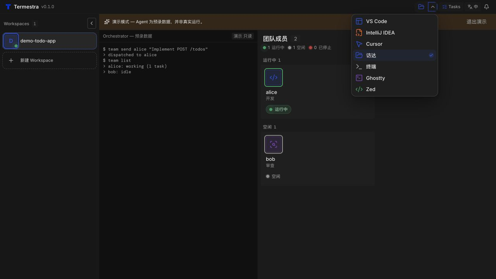

<p align="center">
  
</p>

# Termestra

<p align="center">
  
</p>

**Turn the AI CLIs already on your machine into a visible, persistent team.**

Termestra gives one Orchestrator and multiple CLI workers a shared local
workspace, real terminals, durable task state, and SQLite-first reliable
dispatch. It uses a Java runtime and an explicit three-state team model—without
hidden subagents—so work stays visible instead of disappearing into unrelated
terminal windows.

[](https://adoptium.net/)
[](https://maven.apache.org/)
[](https://nodejs.org/)


[English](README.md) · [简体中文](README.zh-CN.md)

> Termestra is local-first. The server binds to `127.0.0.1`, the database is
> stored on your machine, and every running Agent is a real local CLI process.

## Why Termestra

AI coding CLIs are capable on their own. Coordinating several of them is where
the friction starts:

- every Agent lives in a different terminal and loses shared context;
- it is hard to tell who is working, idle, stopped, or waiting for input;
- a task can be recorded without ever reaching a worker's terminal;
- terminal reconnects and process restarts can hide what actually happened;
- review, testing, and research are often deferred until the primary task ends.

Termestra makes that coordination explicit. The Orchestrator sees a persistent
team, dispatches through a small `team` protocol, and receives reports tied to
stable dispatch IDs. SQLite is authoritative, so refreshes and backend restarts
do not erase the roster or queued work.

## Use It For

**Build, review, and test in parallel**

Create a Coder, Reviewer, and Tester with the built-in scenario, then give the
Orchestrator one outcome instead of micromanaging three terminals.

```text
Implement passwordless sign-in. Have one worker build it, one review the
security boundary, and one add integration coverage. Summarize the evidence.
```

**Research and fact-check**

Let one worker investigate while another checks sources and assumptions. Their
reports remain associated with the real team members that produced them.

```text
Compare these two deployment options. Ask the researcher to gather primary
evidence and the fact-checker to challenge every material claim.
```

**Write documentation as a pipeline**

Use the Docs Pipeline scenario to create a Drafter and a Doc Reviewer, keeping
authorship and review separate without creating hidden subagents.

```text
Rewrite the onboarding guide for a first-time contributor. The drafter should
produce the guide; the reviewer should verify every command against the repo.
```

## Try the Demo First

On the first-run screen, choose **Try Demo** to open a read-only workspace with
pre-recorded Orchestrator, worker, and Tasks data. The demo does not start an AI
CLI, modify a real repository, or consume provider credits.

Use it to explore workspace navigation, resizable panes, worker states, terminal
layout, and task progress before creating a real workspace.

## Product Tour

These four screens use the built-in anonymous demo: first launch, a recorded
task view, the team roster, and the open-target chooser. They do not show a
real Workspace, user account, or running external CLI.

<p align="center">
  
</p>
<p align="center"><sub>Create a trusted local Workspace, or explore the read-only demo without installing an Agent CLI.</sub></p>

<p align="center">
  
</p>
<p align="center"><sub>Explore recorded dispatch activity and task progress without starting an external CLI.</sub></p>

<p align="center">
  
</p>
<p align="center"><sub>Role, state, and pre-recorded terminal context remain visible in the same local workspace.</sub></p>

<p align="center">
  
</p>
<p align="center"><sub>Compatible tools are identified by name while the UI uses Termestra-neutral vector glyphs.</sub></p>

## Quick Start

Termestra is currently an alpha source release (`0.1.0-SNAPSHOT`). The most
reproducible path today is to build it from source.

Requirements:

- JDK 21 or newer
- Maven 3.9 or newer
- Node.js 22.22.2 or newer for the current locked source dependencies
- Corepack with pnpm 10.29.1
- at least one supported Agent CLI installed and signed in

```bash
corepack enable
mvn clean verify
mvn -pl backend spring-boot:run
```

Open [http://127.0.0.1:3000](http://127.0.0.1:3000). Termestra does not open a
browser automatically.

**npm runtime package release**

The packaged-installation contract, isolated global-install verification, and
five-platform release workflow are implemented. The public npm channel is not
declared available until the first protected tag completes its cross-platform
build and published-package verification. Once published, installation and
updates use:

```bash
npm install -g @termestra/cli
termestra
termestra update
```

The npm launcher selects a matching optional platform runtime package, which
contains the jlink Java runtime. Packaged users need Node.js 20+ but do not need
to install a separate JDK. Linux packages require glibc. Use a different port
with:

```bash
termestra --port 4020
```

**First run**

1. Add a Workspace and choose a trusted local directory.
2. Select an Orchestrator CLI preset and start it.
3. Termestra initializes `.termestra/tasks.md` and `.termestra/PROTOCOL.md` in
   the Workspace for task tracking and recovery guidance.
4. Add workers individually, import role templates, or choose a one-click team
   scenario.
5. Give the Orchestrator a goal. It can inspect the visible roster with
   `team list`, dispatch with `team send`, and collect worker reports.

The browser can also be installed as a PWA. Installation does not turn Termestra
into a hosted service; the local Java runtime must still be running.

## How It Works

```text
Browser / installed PWA
        │ HTTP + bounded WebSocket streams
        ▼
Spring WebFlux local runtime (127.0.0.1)
        │
        ├── Workspace, Team, Tasks, Marketplace, Settings
        ├── reliable Dispatch delivery and retry scheduler
        ├── SQLite authoritative state
        └── pty4j process and terminal lifecycle
                    │
                    ├── Orchestrator CLI
                    │       ├── team list
                    │       ├── team send
                    │       └── team cancel
                    └── Worker CLIs
                            ├── team report
                            └── team status
```

Planning, terminal activity, and live team state stay visible through the Tasks
panel, real terminals, and roster without turning the interface into a hidden
workflow engine.

Workers are not in-process model calls. Each member is a visible, persistent
Team Member; while running, it is backed by a real PTY process. A dispatch is
written to SQLite before delivery, delivered in FIFO order per worker, and
tracked separately from the worker's public `idle`, `working`, or `stopped`
state. Roster, configuration, queued work, and run metadata survive a backend
restart; live processes do not, so affected members return as `stopped`.

Delivery failures, retryable failures, and uncertain terminal writes are kept
distinct. An uncertain write is not blindly retried because doing so could run
the same task twice. The UI surfaces delivery issues for explicit recovery.

## Agent Presets

Termestra detects executables from the **backend process PATH**. Installing only
a desktop application does not make its CLI available.

| Preset | Executable | Default launch behavior | Recovery in this release |
| --- | --- | --- | --- |
| Claude Code | `claude` | permission bypass | native session, then summary fallback |
| Codex | `codex` | bypass approvals and sandbox | native session, then summary fallback |
| OpenCode | `opencode` | provider default | native session, then summary fallback |
| Gemini | `gemini` | YOLO mode | native session, then summary fallback |
| Hermes | `hermes` | YOLO mode | Termestra recovery summary |
| Qwen Code | `qwen` | YOLO approval mode | Termestra recovery summary |
| Pi | `pi` | approve mode | Termestra recovery summary |
| Antigravity CLI | `agy` | permission bypass | Termestra recovery summary |
| Cursor CLI | `cursor-agent` | force mode | Termestra recovery summary |
| Grok Build | `grok` | always approve | Termestra recovery summary |
| Custom | user-defined | user-defined command | Termestra recovery summary |

These are convenience defaults, not a sandbox. Review every installed CLI and
its flags before using it on sensitive code.

## What Termestra Provides

- **Persistent workspaces and teams** — names, paths, Orchestrator configuration,
  worker roles, queued work, and run metadata survive browser and backend
  restarts; live PTYs and live status do not.
- **Real terminal sessions** — interactive xterm views over bounded WebSocket
  streams, including resize handling, reconnect snapshots, and per-viewer flow
  control.
- **Reliable dispatch** — message, dispatch, and delivery records are admitted
  atomically; a background scheduler performs finite retries and resumes pending
  delivery after a backend restart.
- **Visible delivery problems** — definite failures and uncertain PTY writes are
  shown for deliberate retry instead of being silently dropped.
- **One-click team scenarios** — Build · Review · Test, Research & Fact-check,
  and Docs Pipeline create real persistent members and brief the Orchestrator.
- **Worker role marketplace** — bundled English and Chinese role templates can
  be reviewed before they are added to a Workspace.
- **Tasks surface** — `.termestra/tasks.md` is watched and synchronized with revision
  checks so concurrent local and browser edits produce an explicit conflict.
- **Restart recovery** — Claude, Codex, Gemini, and OpenCode use captured native
  sessions when available; every provider has a persisted recovery-summary
  fallback.
- **Workspace tools** — native folder selection, in-browser server browsing,
  pasted absolute paths, and open-in actions for supported editors, terminals,
  and file managers.
- **Local demo, PWA, and bilingual UI** — explore the interface without a live
  provider, install it as a desktop-like PWA, and switch between English and
  Simplified Chinese.
- **Transactional metadata deletion** — deleting a Workspace or member removes
  its Termestra-owned database graph in one SQLite transaction; a database
  failure rolls the graph back. The selected source directory and its files are
  never deleted.

Termestra intentionally does **not** currently provide hidden auto-spawned
subagents, Workflow/DAG automation, scheduled runs, Team Memory, remote access,
or multi-user authentication. It also cannot cryptographically force an
Orchestrator model to delegate instead of working directly; delegation is a
visible protocol and prompt contract.

## Platform Targets

The packaging pipeline builds, packs, and globally installs these targets in
native CI. They remain pre-release targets until the project completes its first
public tagged release and production-switch validation on every operating system.

| Platform | Package target | Folder selection |
| --- | --- | --- |
| macOS arm64 / x64 | `@termestra/runtime-darwin-*` | native `osascript`, server browser, or pasted path |
| Linux arm64 / x64 (glibc) | `@termestra/runtime-linux-*` | `zenity` when present, server browser, or pasted path |
| Windows x64 | `@termestra/runtime-win32-x64` | PowerShell folder dialog, server browser, or pasted path |

If `zenity` is unavailable on Linux, use **Browse Server Filesystem** or paste an
absolute directory path.

## Safety Model

- The HTTP server binds to `127.0.0.1` and rejects non-loopback Host/Origin
  requests. UI and Agent requests use separate process/session-scoped tokens.
- This is local application protection, not multi-user authentication and not a
  security boundary against other processes running as the same OS user.
- Built-in Agent presets deliberately use bypass, YOLO, force, or approve flags.
  Managed CLIs inherit the current OS user's file and process permissions.
- Choose only trusted Workspace directories and review every advanced custom
  launch command. Do not expose the port through a tunnel or reverse proxy.
- Demo mode is the safest way to inspect the interface: it starts no real Agent.
- Workspace and member deletion permanently removes the corresponding Termestra
  metadata, team, messages, and run history. It does **not** delete the selected
  source directory or its files.

## Data and Workspace Files

| Data | Location | Notes |
| --- | --- | --- |
| Runtime metadata | `~/.config/termestra/termestra.db` | SQLite; all platforms currently use this default |
| Task document | `<workspace>/.termestra/tasks.md` | synchronized task plan and progress document |
| Agent protocol guide | `<workspace>/.termestra/PROTOCOL.md` | generated/refreshed recovery and team guidance |
| Packaged web UI | embedded in the Java application | served only by the local runtime |

Override the data directory with `TERMESTRA_DATA_DIRECTORY` or
`TERMESTRA_DATA_DIR`.

SQLite stores Workspace and member configuration, run/session metadata,
messages, dispatch/delivery records, settings, and application state. It does
not store every Agent's complete terminal history in list responses or as an
unbounded database transcript. PTY scrollback is a bounded in-memory projection
and is lost when the backend restarts.

## Troubleshooting

**An Agent preset says “not found”**

Termestra checks the PATH inherited by the Java backend. From the same shell that
starts Termestra, verify the command first:

```bash
command -v codex
command -v claude
```

On Windows, use `where codex`. A desktop-only Codex installation is not enough;
install and authenticate the corresponding CLI.

**`team` fails in a normal shell**

This is expected. `team` is primarily for Termestra-managed Agent sessions,
where `TERMESTRA_PORT`, Workspace/Agent IDs, and a session token are injected.

**The default port is already in use**

```bash
termestra --port 4020
```

For a source launch, use `TERMESTRA_PORT=4020` before the Maven command.

**Agent startup times out while waiting for pasted input**

Confirm that the CLI reached an interactive prompt, completed login/setup, and
matches the selected input profile. Retry after the prompt is ready, or use a
reviewed custom launch command for that provider version.

**A terminal says its IO connection closed**

Close and reopen the terminal to reconnect. If it repeats, verify that the
backend is still running and inspect the backend log; the worker process and the
viewer connection have separate lifecycles.

**A worker remains `working`**

The worker must report or the Orchestrator must cancel the open dispatch. From a
managed worker session, use `team report "<result>" --dispatch <id>` (or
`team report --stdin --dispatch <id>`); from the Orchestrator, use
`team cancel --dispatch <id> "<reason>"`.

**A Tasks conflict appears**

It means the Workspace file changed independently while the browser had local
edits. Review both versions, then deliberately reload the remote version or save
a new revision. Termestra does not silently overwrite either side.

## Development

The Maven reactor contains `frontend`, `backend`, and `distribution` modules.
The full verification command installs locked frontend dependencies, checks and
tests TypeScript, builds the React UI, runs Java unit and real-boundary
integration tests, enforces architecture rules, builds the Spring Boot app, and
assembles the host distribution.

```bash
corepack enable
mvn clean verify
```

The distribution build invokes POSIX `sh`. On Windows, run the full reactor in
Git Bash or another environment that provides `sh`.

For frontend hot reload, run the backend and Vite separately:

```bash
# terminal 1 — repository root
TERMESTRA_PORT=4010 mvn -pl backend spring-boot:run
```

PowerShell equivalent:

```powershell
$env:TERMESTRA_PORT = "4010"
mvn -pl backend spring-boot:run
```

```bash
# terminal 2 — repository root
cd frontend
corepack enable
pnpm install --frozen-lockfile
pnpm exec vite --config web/vite.config.ts
```

Vite listens on `127.0.0.1:5180` and proxies to port `4010` by default. Override
these defaults with `TERMESTRA_WEB_PORT` and `TERMESTRA_RUNTIME_PORT`.

Generated release inputs are written to:

- `backend/target/termestra-backend-0.1.0-SNAPSHOT.jar`
- `distribution/target/npm-cli`
- `distribution/target/npm/runtime-<platform>-<arch>`
- `distribution/target/runtime-current`

## Architecture

Termestra is a frontend/backend monorepo and a package-by-feature modular
monolith, not a collection of small Maven microservices.

```text
termestra/
├── frontend/       React, TypeScript, Vite, xterm
├── backend/        Java 21, Spring Boot/WebFlux, SQLite JDBC, pty4j
├── distribution/   jlink images and platform npm packages
├── docs/           current architecture, decisions, design, research, and status
└── scripts/        repository utilities
```

The backend applies domain-driven design, hexagonal ports/adapters, and light
CQRS inside business capabilities such as `workspace`, `team`, `execution`,
`terminal`, and `tasks`. SQLite is authoritative: persisted state is committed
before in-memory projections are updated. Spring wiring and technical adapters
stay outside domain code, and ArchUnit verifies the main dependency rules.

Read the documentation in this order:

- [Documentation map](docs/README.md)
- [Current architecture overview](docs/architecture/overview.md)
- [Runtime flows](docs/architecture/runtime-flows.md)
- [Contracts and data ownership](docs/architecture/contracts-and-data.md)
- [Accepted architecture decisions](docs/adr/README.md)
- [Reliable dispatch design](docs/design/reliable-dispatch.md)
- [npm runtime package release](docs/release/npm.md)
- [Roadmap](docs/product/roadmap.md)

## Current Status

Termestra is alpha software at `0.1.0-SNAPSHOT`. Core local Workspace, terminal,
team, Tasks, scenario, recovery, and reliable-delivery paths have automated
coverage. The platform packaging pipeline now verifies the final npm tarballs
through isolated installs, but public-asset release gates and the first five-
platform tagged publish still need validation.

The current source of truth is Termestra's own public contracts, automated tests,
and accepted architecture decisions.

## Attribution and Licensing

Bundled worker-role marketplace snapshots derive from
[agency-agents](https://github.com/msitarzewski/agency-agents) and
[agency-agents-zh](https://github.com/jnMetaCode/agency-agents-zh). Their source
and license records are retained under
`backend/src/main/resources/vendor/marketplace/`. Bundled sound attribution is
retained in `frontend/web/public/sounds/LICENSE-KENNEY.txt`.

Portions derived from Hive remain distributed under the
[Business Source License 1.1](LICENSE.BSL), with the legally required provenance
and attribution retained in [NOTICE](NOTICE). This is a source-available license,
not an OSI open-source license. Historical terms are documented in
[LICENSE](LICENSE); do not assume the current combined work is MIT- or
Apache-licensed. Brand provenance and third-party marks are described in
[TRADEMARK.md](TRADEMARK.md). Bundled third-party materials and unresolved asset
permission checks are listed in
[THIRD_PARTY_NOTICES.md](THIRD_PARTY_NOTICES.md). A fact-based review of the
repository's licensing boundary is available in
[licensing review](docs/governance/licensing-review.md).

Third-party product names and marks belong to their respective owners. Their use
describes CLI compatibility and does not imply affiliation or endorsement.
