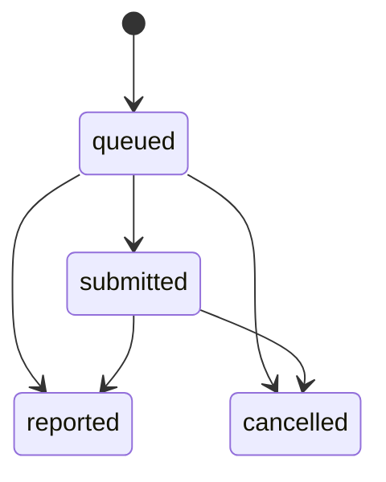
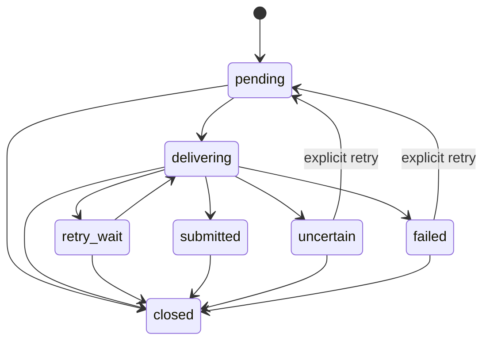

# 契约与数据

本文件记录跨模块最容易被误改的公共状态、传输边界和数据所有权。具体字段以
controller/DTO、前端 wire type 和边界测试为准。

## 本地安全边界

`application.properties` 默认绑定 `127.0.0.1:3000`。请求依次经过：

1. `LocalOnlyFilter`：remote address 必须是 loopback，Host 与 Origin 只能是
   `localhost`、`127.0.0.1` 或 `::1`，URI 中 IPv6 literal 的方括号在白名单检查前规范化；
2. `UiSessionFilter`：UI API 与所有 WebSocket 要求进程级 HttpOnly、SameSite
   Strict cookie；
3. Team application authentication：`/api/team/*` 使用注入到托管 Run 的
   Agent ID 与 Agent Credential，并校验角色权限。

`/api/version`、创建 UI Session 和面向 managed Agent 的 Team protocol 是明确
例外。该模型防止普通跨站浏览器请求，不构成多用户认证，也不防御同一 OS 用户
下的恶意进程。

## HTTP endpoint 族

| endpoint 族 | 主要消费者 | 所属上下文 |
| --- | --- | --- |
| `/api/workspaces`, `/api/workspace-registrations`, `/api/fs`, Workspace `open` | Browser UI | Workspace |
| `/api/workspaces/*/team`, `/workers`, `/scenarios`, `/api/team/*` | Browser / managed CLI | Team |
| `/api/workspaces/*/agents`, `/api/runtime/runs`, `user-input`, `shell` | Browser UI | Agent Execution |
| `GET /api/ui/workspaces/{workspace_id}/agent-launch-options` | Browser UI | Agent Execution |
| `GET /api/ui/workspaces/{workspace_id}/agent-launch-options/{preset_id}/models` | Browser UI | Agent Execution |
| `/api/workspaces/*/tasks` | Browser UI | Tasks |
| `/api/settings`, `/api/ui/settings` | Browser UI | Configuration |
| `/api/marketplace` | Browser UI | Marketplace |
| `/api/ui/session` | Browser bootstrap | Auth |
| `/api/version` | Browser/PWA/npm update UI | Platform web |

UI 专用 projection 使用 `/api/ui/...` 命名。managed Agent 的 `/api/team/*` 不应
复用 UI Session 认证。新增 endpoint 时保持所属上下文明确，避免 controller 直接
访问 JDBC 或 PTY adapter。

Role Template 与 TeamMember 的角色正文最多 65,536 字符。Role Template 集合保持
最多 132 条、每条 description 最多 4,096 字符的摘要投影；
`GET /api/settings/role-templates/{id}` 按需读取单条完整正文，不存在时返回 404。
Marketplace 导入保留全文，创建 Worker 与保存模板使用相同正文容量。
自动启动或派单 prompt 在角色正文与协议包装组合后仍有 393,216 字符硬上限，
包含启动正文 XML 转义所需的空间。

模型列表 endpoint 最多返回 256 个 CLI 动态枚举结果；不支持、失败或空结果统一返回
空列表，不回退到 Configuration 的静态建议。相同 Workspace/preset 的冷请求共用一次
发现过程，进程发现全局最多同时执行 4 个，容量不足时立即退化为 CLI 默认模型。

## WebSocket 契约

| 路径 | 消息方向 | 关键语义 |
| --- | --- | --- |
| `/ws/terminal/{runId}/io` | server text output；client raw input | 有界 frame/queue；逐字节 acknowledgement 在 control channel |
| `/ws/terminal/{runId}/control` | 双向 JSON | `restore`、`resize`、`output_ack`、`stop`、`error`、`exit` |
| `/ws/tasks/{workspaceId}` | server JSON | 初始 `tasks-snapshot`，随后 latest-only `tasks-updated` |

Terminal 的 snapshot-to-live handoff 以 output sequence 为游标，不能丢失或重复
输出。一个 Run 最多跟踪有限 viewer/connection；慢消费者超出窗口会被关闭并
释放全局 PTY pressure lease。Tasks 最后一个订阅者断开时关闭文件 watcher。

## Wire 命名和错误

- HTTP/JSON 字段使用 `snake_case`；Java DTO 通过 Jackson 注解，TypeScript 在
  `api.ts` 显式映射为 `camelCase`。
- typed failure 优先映射到稳定 HTTP status；需要客户端分支时增加稳定
  `error_code`，例如 `RUNTIME_OPERATION_BUSY`、`TASKS_REVISION_CONFLICT`。
- 409 busy 明确 `retryable=true` 和 `retry_after_ms`；未知 PTY 副作用不能被降级成
  普通可重试错误。
- 请求体、字符串、参数个数、集合、错误文本和 transport frame 都有代码级上限。

Workspace 与 Worker 创建接受 `launch` tagged union：`preset`、`startup`，Worker
另支持 `inherit_orchestrator`。`preset` 可携带 `model_id` 和
`expected_preset_revision`；继承可携带 `expected_source_revision`。结构化 launch 与
legacy `command_preset_id` / `startup_command` 同时出现时返回
`LAUNCH_CONTRACT_CONFLICT`；tagged union 中出现不属于当前 `type` 的字段也返回同一错误。
旧版 Worker `startup_command` 遇到已删除的 recovery preset 时继续按原始命令启动，结构化
`startup` 则严格拒绝。preset 或来源 revision 变化返回 409，客户端必须刷新
options 后由用户重新确认，不能静默改用新配置。

## 公共状态机

### TeamMember

```text
stopped  = 没有完成启动的受管理 Run（包括仍在 starting）
idle     = running Run + 0 个 open Dispatch
working  = running Run + 至少 1 个 open Dispatch
```

公共状态只允许 `idle`、`working`、`stopped`。`starting/running/exited/error` 是
Agent Execution 的 Run 状态，不能泄露为 TeamMember 状态。

### Dispatch



`submitted` 只证明任务正文完整写入 Worker PTY，不代表 Worker 已开始或完成。
`reported` 与 `cancelled` 是业务终态。

### Delivery



Delivery 是 Team 自有的技术恢复状态，不取代 Dispatch。只有明确证明输入未触达
时才自动有限重试；`uncertain` 禁止自动重试。启动尚未完成或 CLI 明确生成中的内部 `deferred` 结果没有
尝试输入，复用 claim 延后机制而不消耗失败重试额度；它不是新的公开 Dispatch 或
Delivery 状态。最新 retained Run 已启动失败且没有 active Run 时，自动投递返回普通
失败，用户可显式重新启动；该防自动重启保护不超出有界 Run 保留范围。

### 汇报通知恢复

汇报已接收与通知已送达分别记录；通知失败不回退 `reported` Dispatch。
`GET /api/ui/workspaces/{workspaceId}/report-delivery-issues?limit=100` 只返回
`failed`、`uncertain` 通知，`limit` 默认 100，允许 0–100，越界返回 400。
每项字段固定为 `dispatch_id`、`worker_id`、`state`、`attempt_count`、`error`、
`updated_at`；`error` 最多 2048 字符，不携带汇报正文或 artifacts。

`POST /api/ui/workspaces/{workspaceId}/dispatches/{dispatchId}/report-delivery/retry`
接受可选 JSON `{ "confirm_uncertain": true }`。`failed` 可直接显式重试，
`uncertain` 必须传入该确认；未确认、跨 Workspace 或状态不符均返回 409。
成功返回 202 `{ "ok": true, "dispatch_id": "…" }`，原子重置通知尝试次数、
租约和错误并进入 `pending`，不重建 Report 或改变 Dispatch。两个接口均要求 UI token。
UI 合并最多 100 条派单问题与 100 条汇报通知问题，不确定通知的重试先展示重复发送确认。

### Run

Run 持久状态为 `starting`、`running`、`exited`、`error`。前两者 active，后两者
terminal。交互式 Agent 的 `running` 只在输入框就绪且启动/恢复输入完整提交（含 Enter）
后持久化；provider-native resume 只等输入框就绪，不重复提交启动文本。PTY 首次输出
不代表启动完成。Shell 和非交互式进程不要求输入框握手。

Run detail 与 terminal summary 另包含 `startup_phase` 和 nullable `startup_message`，
后者最多 500 字符。phase 为 `initializing`、`waiting_for_user`、`ready` 或 `failed`，
表示当前受管理 Run 的启动进度，不新增持久 Run 或 TeamMember 状态。
`waiting_for_user` 的 Run 仍为 `starting`，保留 PTY 供人操作；进程启动请求成功仅表示
请求已接受，客户端须依据 Run 状态和 phase 判断是否就绪。初始化等待累计最多 120 秒，
启动等待总计最多 10 分钟；超时作为启动失败清理。phase 与失败提示是有界进程内投影，
不承诺后端重启后的持久错误历史。

停止或 PTY 退出必须先确认进程树终止并持久化 terminal 状态；UI 可在
持久化重试期间保守显示终止/错误，而不是继续显示工作中。原生终止调用的等待期限
只约束请求或生命周期调用方；到期时 Run 仍持有 credential 与容量，直到后台监管器
确认进程树停止，不能把超时当作已终止。

## SQLite 所有权

当前 schema 版本为 35，由 `SqliteSchemaMigrator` 在启动时事务迁移。

| 表 | 所有者 | 说明 |
| --- | --- | --- |
| `workspaces` | Workspace | 身份、路径、规范路径唯一性、`preparing/active` 生命周期与 legacy 删除标记 |
| `workspace_registration_attempts` | Workspace | 注册幂等键、规范路径 claim 与恢复状态；最多保留 4096 条；Git 选择/checkout 列仅为旧数据库兼容保留 |
| `workers` | Team | TeamMember、角色、描述、名称唯一性与 legacy 删除标记 |
| `messages` | Team | send/report/status 的有界审计记录与 Dispatch 关联 |
| `dispatches` | Team | 公开业务状态与 idempotency key |
| `dispatch_deliveries` | Team | Team-owned outbox、attempt/lease/错误恢复状态 |
| `report_deliveries` | Team | 每 Dispatch 至多一条汇报通知；与汇报同事务创建，保存 attempt/lease/错误状态，随 Dispatch 外键级联删除 |
| `agent_launch_configs` | Agent Execution | 命令、含 yolo/model 展开的最终参数、环境、preset、model、revision 和 session capture 配置 |
| `agent_runs` | Agent Execution | Run/PID/终态/时间证据 |
| `agent_sessions` | Agent Execution | 每 Agent 最近可恢复 provider session |
| `command_presets` | Configuration | 内建与自定义 CLI 启动预设、model capability 与 revision |
| `role_templates` | Configuration | 内建与自定义角色模板 |
| `app_state` | Configuration | 小型本地 UI key/value 状态 |
| `schema_version` | Platform persistence | 已应用 migration 版本 |

Terminal、Auth 和 Marketplace 没有独立 SQLite 表：Terminal viewer/mirror 与 Auth
token 是进程内状态；Marketplace 是随包 classpath 快照。Tasks 的权威正文位于
Workspace 文件系统而不是 SQLite。

表所有权约束普通读写；Workspace/Worker hard delete 会由发起上下文的 persistence
adapter 在单事务中删除整个 lifecycle graph。这是销毁一致性的窄例外，不是允许
任意 context 直接修改他者状态。

## 有界读模型

Summary 端点只返回固定字段和固定长度派生数据；Detail 端点按单个 ID 加载，并
对正文设上限；Stream 只传递增量数据。典型例子：

- UI Run list 通过 `listTerminalSummaries` 读取 `AgentRunSummaryView`，不构造包含
  1 MB output 的 `AgentRunView`。保留全部 active Run，并对没有 active Run 的 Agent
  追加其最新 retained Run 为启动失败的项；正常退出不加入该列表。活动 Run 仍受全局 128、每 Workspace 32
  的容量约束，失败项共用全局最多 16 个已完成 Run 的保留额度。内部
  `listActiveSummaries` 继续只返回 active Run，不把失败项用于运行状态投影；
- Team list 的 `last_pty_line` 固定到 60 code points，只作为 UI hint；
- Dispatch list 截断任务/报告，detail 才提供更完整但仍有界的内容；
- Delivery issue 使用专用 SQL projection，不能先截普通队列再由浏览器过滤；
- Tasks Document 受文件与 JSON transport 两层限制，Terminal output 受保留 buffer、
  pending publication 和 viewer window 多层限制。

任何新 list/poll 需要测试“详情历史增长后响应大小仍保持常数”。

## Workspace 注册

- `/api/fs/probe` 返回所选目录的存在性、目录/Git 判断与只读的当前分支提示；不签发
  Git token。
- `POST /api/workspaces` 接受 UUID `registration_id`，注册所选目录的当前 checkout，
  不枚举、创建或切换 Git 分支。旧客户端的 `revision_selection.kind=current` 仍兼容；
  其他 kind 或缺失 kind 返回 400 + `WORKSPACE_REVISION_SELECTION_UNSUPPORTED`。
- 已删除的 `GET /api/workspace-registrations/options` 返回 410 +
  `WORKSPACE_REVISION_OPTIONS_REMOVED`，避免旧客户端把 `options` 误解释为 registration UUID。
- `GET /api/workspace-registrations/{registration_id}` 返回
  `registration_id/status/workspace_id/error_code/source_revision_changed/observed_head`，其中状态为
  `processing/completed/failed/needs_attention`。后两个 nullable 字段仅为旧 Git 注册 attempt
  的升级诊断兼容保留。
- Workspace 在规范路径 claim 和元数据初始化完成后才变为 `active`。旧版本遗留的
  `switching/uncertain` attempt 保留 HEAD/结果诊断证据，以
  `WORKSPACE_REGISTRATION_INTERRUPTED` 失败并释放路径 claim；新版本不会执行 Git mutation，
  也不会新建 `uncertain` attempt。
