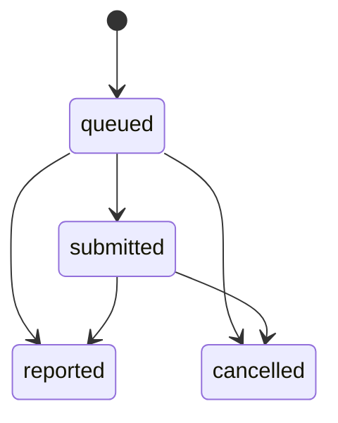
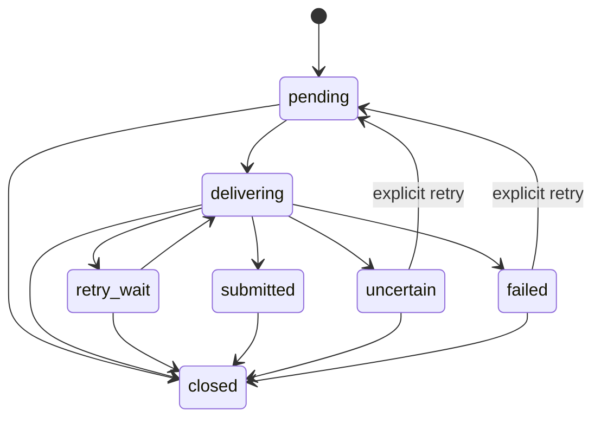

# 契约与数据

本文件记录跨模块最容易被误改的公共状态、传输边界和数据所有权。具体字段以
controller/DTO、前端 wire type 和边界测试为准。

## 本地安全边界

`application.properties` 默认绑定 `127.0.0.1:3000`。请求依次经过：

1. `LocalOnlyFilter`：remote address 必须是 loopback，Host 与 Origin 只能是
   `localhost`、`127.0.0.1` 或 `::1`；
2. `UiSessionFilter`：UI API 与所有 WebSocket 要求进程级 HttpOnly、SameSite
   Strict cookie；
3. Team application authentication：`/api/team/*` 使用注入到托管 Run 的
   Agent ID 与 Agent Credential，并校验角色权限。

`/api/version`、创建 UI Session 和面向 managed Agent 的 Team protocol 是明确
例外。该模型防止普通跨站浏览器请求，不构成多用户认证，也不防御同一 OS 用户
下的恶意进程。

## HTTP endpoint 族

| endpoint 族 | 主要消费者 | 所属上下文 |
| --- | --- | --- |
| `/api/workspaces`, `/api/workspace-registrations`, `/api/fs`, Workspace `open` | Browser UI | Workspace |
| `/api/workspaces/*/team`, `/workers`, `/scenarios`, `/api/team/*` | Browser / managed CLI | Team |
| `/api/workspaces/*/agents`, `/api/runtime/runs`, `user-input`, `shell` | Browser UI | Agent Execution |
| `GET /api/ui/workspaces/{workspace_id}/agent-launch-options` | Browser UI | Agent Execution |
| `/api/workspaces/*/tasks` | Browser UI | Tasks |
| `/api/settings`, `/api/ui/settings` | Browser UI | Configuration |
| `/api/marketplace` | Browser UI | Marketplace |
| `/api/ui/session` | Browser bootstrap | Auth |
| `/api/version` | Browser/PWA/npm update UI | Platform web |

UI 专用 projection 使用 `/api/ui/...` 命名。managed Agent 的 `/api/team/*` 不应
复用 UI Session 认证。新增 endpoint 时保持所属上下文明确，避免 controller 直接
访问 JDBC 或 PTY adapter。

## WebSocket 契约

| 路径 | 消息方向 | 关键语义 |
| --- | --- | --- |
| `/ws/terminal/{runId}/io` | server text output；client raw input | 有界 frame/queue；逐字节 acknowledgement 在 control channel |
| `/ws/terminal/{runId}/control` | 双向 JSON | `restore`、`resize`、`output_ack`、`stop`、`error`、`exit` |
| `/ws/tasks/{workspaceId}` | server JSON | 初始 `tasks-snapshot`，随后 latest-only `tasks-updated` |

Terminal 的 snapshot-to-live handoff 以 output sequence 为游标，不能丢失或重复
输出。一个 Run 最多跟踪有限 viewer/connection；慢消费者超出窗口会被关闭并
释放全局 PTY pressure lease。Tasks 最后一个订阅者断开时关闭文件 watcher。

## Wire 命名和错误

- HTTP/JSON 字段使用 `snake_case`；Java DTO 通过 Jackson 注解，TypeScript 在
  `api.ts` 显式映射为 `camelCase`。
- typed failure 优先映射到稳定 HTTP status；需要客户端分支时增加稳定
  `error_code`，例如 `RUNTIME_OPERATION_BUSY`、`TASKS_REVISION_CONFLICT`。
- 409 busy 明确 `retryable=true` 和 `retry_after_ms`；未知 PTY 副作用不能被降级成
  普通可重试错误。
- 请求体、字符串、参数个数、集合、错误文本和 transport frame 都有代码级上限。

Workspace 与 Worker 创建接受 `launch` tagged union：`preset`、`startup`，Worker
另支持 `inherit_orchestrator`。`preset` 可携带 `model_id` 和
`expected_preset_revision`；继承可携带 `expected_source_revision`。结构化 launch 与
legacy `command_preset_id` / `startup_command` 同时出现时返回
`LAUNCH_CONTRACT_CONFLICT`；tagged union 中出现不属于当前 `type` 的字段也返回同一错误。
旧版 Worker `startup_command` 遇到已删除的 recovery preset 时继续按原始命令启动，结构化
`startup` 则严格拒绝。preset 或来源 revision 变化返回 409，客户端必须刷新
options 后由用户重新确认，不能静默改用新配置。

## 公共状态机

### TeamMember

```text
stopped  = 没有受管理的 active Run
idle     = active Run + 0 个 open Dispatch
working  = active Run + 至少 1 个 open Dispatch
```

公共状态只允许 `idle`、`working`、`stopped`。`starting/running/exited/error` 是
Agent Execution 的 Run 状态，不能泄露为 TeamMember 状态。

### Dispatch



`submitted` 只证明任务正文完整写入 Worker PTY，不代表 Worker 已开始或完成。
`reported` 与 `cancelled` 是业务终态。

### Delivery



Delivery 是 Team 自有的技术恢复状态，不取代 Dispatch。只有明确证明输入未触达
时才自动有限重试；`uncertain` 禁止自动重试。

### Run

Run 持久状态为 `starting`、`running`、`exited`、`error`。前两者 active，后两者
terminal。停止或 PTY 退出必须先确认进程树终止并持久化 terminal 状态；UI 可在
持久化重试期间保守显示终止/错误，而不是继续显示工作中。原生终止调用的等待期限
只约束请求或生命周期调用方；到期时 Run 仍持有 credential 与容量，直到后台监管器
确认进程树停止，不能把超时当作已终止。

## SQLite 所有权

当前 schema 版本为 30，由 `SqliteSchemaMigrator` 在启动时事务迁移。

| 表 | 所有者 | 说明 |
| --- | --- | --- |
| `workspaces` | Workspace | 身份、路径、规范路径唯一性、`preparing/active` 生命周期与 legacy 删除标记 |
| `workspace_registration_attempts` | Workspace | 注册幂等键、Git 选择意图、checkout 结果证据与恢复状态；最多保留 4096 条 |
| `workers` | Team | TeamMember、角色、描述、名称唯一性与 legacy 删除标记 |
| `messages` | Team | send/report/status 的有界审计记录与 Dispatch 关联 |
| `dispatches` | Team | 公开业务状态与 idempotency key |
| `dispatch_deliveries` | Team | Team-owned outbox、attempt/lease/错误恢复状态 |
| `agent_launch_configs` | Agent Execution | 命令、含 yolo/model 展开的最终参数、环境、preset、model、revision 和 session capture 配置 |
| `agent_runs` | Agent Execution | Run/PID/终态/时间证据 |
| `agent_sessions` | Agent Execution | 每 Agent 最近可恢复 provider session |
| `command_presets` | Configuration | 内建与自定义 CLI 启动预设、model capability 与 revision |
| `role_templates` | Configuration | 内建与自定义角色模板 |
| `app_state` | Configuration | 小型本地 UI key/value 状态 |
| `schema_version` | Platform persistence | 已应用 migration 版本 |

Terminal、Auth 和 Marketplace 没有独立 SQLite 表：Terminal viewer/mirror 与 Auth
token 是进程内状态；Marketplace 是随包 classpath 快照。Tasks 的权威正文位于
Workspace 文件系统而不是 SQLite。

表所有权约束普通读写；Workspace/Worker hard delete 会由发起上下文的 persistence
adapter 在单事务中删除整个 lifecycle graph。这是销毁一致性的窄例外，不是允许
任意 context 直接修改他者状态。

## 有界读模型

Summary 端点只返回固定字段和固定长度派生数据；Detail 端点按单个 ID 加载，并
对正文设上限；Stream 只传递增量数据。典型例子：

- Run list 读取 `AgentRunSummaryView`，不构造包含 1 MB output 的 `AgentRunView`；
- Team list 的 `last_pty_line` 固定到 60 code points，只作为 UI hint；
- Dispatch list 截断任务/报告，detail 才提供更完整但仍有界的内容；
- Delivery issue 使用专用 SQL projection，不能先截普通队列再由浏览器过滤；
- Tasks Document 受文件与 JSON transport 两层限制，Terminal output 受保留 buffer、
  pending publication 和 viewer window 多层限制。

任何新 list/poll 需要测试“详情历史增长后响应大小仍保持常数”。

## Workspace 注册与 Git 选择

- `/api/fs/probe` 对 Git 工作树根返回短期、进程级签名的
  `git_inspection_token`；token 不包含可供客户端篡改的权威路径。
- `GET /api/workspace-registrations/options` 只列本地 `refs/heads/*`，每页最多
  100 条；不执行 fetch，不列远端分支，也不创建分支。每个可选项带绑定工作树、
  HEAD、branch OID 与 worktree 占用状态的 `selection_token`。
- `POST /api/workspaces` 接受 UUID `registration_id` 和
  `revision_selection.kind=current|local_branch`。选择本地分支时必须提交分支名与
  `selection_token`。
- `GET /api/workspace-registrations/{registration_id}` 返回
  `processing/completed/failed/needs_attention`，供超时或断线后的显式核对。
- Git switch 是非事务型外部副作用。结果无法确认时返回稳定
  `GIT_OPERATION_OUTCOME_UNKNOWN`，并令 `source_revision_changed=null`；系统禁止
  自动重试。Workspace 只在 checkout 结果和元数据初始化均已确认后变为 `active`。
