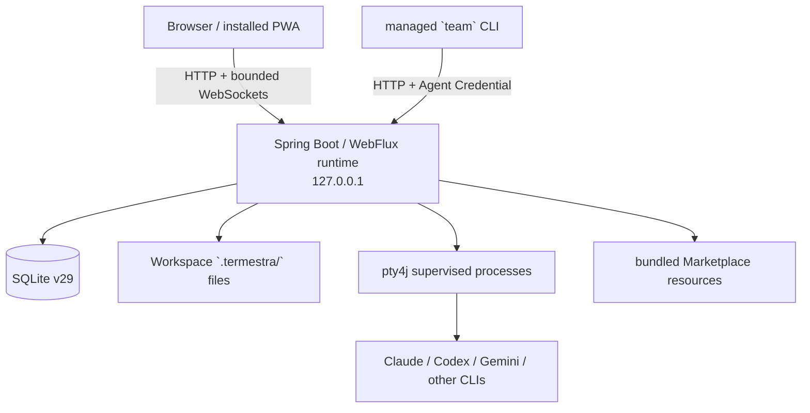
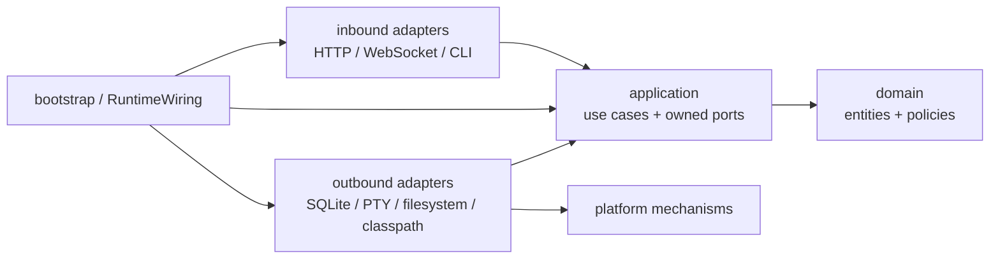

# Termestra 架构总览

> 当前实现基线：2026-08-20，schema v29，版本 `0.1.2-SNAPSHOT`。

Termestra 是本地优先的 CLI Agent 团队工作台。浏览器只连接绑定在
`127.0.0.1` 的 Java 运行时；每个 Orchestrator、Worker 和 Workspace Shell 都是
真实的本地 PTY 进程。SQLite 保存可恢复的权威状态，终端屏幕和实时连接属于
有界的进程内投影。

## 系统视图



系统不是远程多用户服务，也不是在 Java 进程内直接调用模型。浏览器/PWA 是
本地运行时的客户端；PWA 离线缓存不包含 API 或 WebSocket 数据。

## 构建单元

仓库只有三个 Maven 构建单元：

```text
termestra/
├── frontend/       React 19、TypeScript、Vite、xterm.js
├── backend/        Java 21、Spring Boot 4、SQLite JDBC、pty4j
├── distribution/   macOS jlink 运行时、npm CLI 与架构可选包
├── docs/           当前架构、ADR、设计、调研、治理、路线图
└── scripts/        仓库级校验
```

`backend` 是一个部署单元，不是由细碎 Maven 模块拼成的微服务集合。业务隔离
主要由包所有权、应用端口和 ArchUnit 保证。这个选择的历史理由见
[ADR-0002](../adr/0002-package-by-feature-modular-monolith.md)。

公开发行仅支持 macOS Apple Silicon 与 Intel。平台包由
[`trim-macos-application.sh`](../../distribution/scripts/trim-macos-application.sh) 在组装时
删除 SQLite、pty4j、JNA 和 Netty 中非目标操作系统/架构的原生内容，并由
[`verify-npm-runtime.mjs`](../../distribution/scripts/verify-npm-runtime.mjs) 检查成品内容；
平台收缩及恢复门槛见 [ADR-0007](../adr/0007-macos-only-distribution.md)。

## 后端上下文

业务上下文与所有权的完整定义在根目录
[`CONTEXT-MAP.md`](../../CONTEXT-MAP.md)。当前八个上下文为：

| 上下文 | 权威状态或职责 | 主要代码入口 |
| --- | --- | --- |
| Workspace | Workspace 身份、规范路径、注册与生命周期 | `workspace/application/service/WorkspaceApplicationService` |
| Team | TeamMember、Dispatch、Delivery、Report、Scenario | `team/application/service/TeamApplicationService` |
| Agent Execution | Launch Configuration、Run、PTY、恢复 | `execution/application/service/AgentExecutionService` |
| Terminal | Run 的浏览器查看协议与屏幕投影 | `terminal/adapter/in/http/TerminalWebSocketHandler` |
| Tasks | `tasks.md`、revision、文件监听、协议指南 | `tasks/application/service/TasksApplicationService` |
| Configuration | Command Preset、Role Template、App State | `configuration/application/service/ConfigurationApplicationService` |
| Marketplace | 随包只读角色目录 | `marketplace/adapter/out/classpath/ClasspathMarketplaceCatalog` |
| Auth | UI Session、Agent Credential、本地访问限制 | `auth/adapter/in/http/*Filter` |

`shared`、`platform` 和 `bootstrap` 不是业务上下文。`shared` 只容纳稳定 ID 与运行
时协调原语；`platform` 提供 SQLite、进程、公共 Web/CLI 机制；`bootstrap` 在
`RuntimeWiring` 中装配所有接口和 adapter。

## 核心依赖方向



箭头表示源码依赖。应用层拥有端口，adapter 依赖并实现这些接口；应用层不会
反向导入 adapter。ArchUnit 强制 domain、application、inbound adapter 和
shared kernel 的主要规则，详见
`backend/src/test/java/dev/termestra/architecture/ArchitectureTest.java`。

## 五条设计主线

1. **SQLite 先于投影。** 持久状态提交后，才失效缓存、唤醒后台运行时或更新
   进程内投影。
2. **业务状态与技术投递分离。** Dispatch 表示业务任务；Delivery 表示把任务
   放入 PTY 的技术过程。两者状态机不混用。
3. **摘要、详情、流分离。** 轮询只读取有界摘要；大正文按需加载；持续输出走
   有背压和清理的流。
4. **真实资源用精确键协调。** Workspace 与 Agent 的生命周期冲突通过
   `RuntimeOperationCoordinator` 限时协调，避免无界等待和 hash stripe 碰撞。
5. **本地副作用承认不确定性。** PTY 写入不是事务；可能触达时进入
   `uncertain`，不以自动重试掩盖重复执行风险。

## 明确的非目标

当前产品不提供隐藏自动 subagent、通用 Workflow/DAG、定时执行、远程访问、
多用户账户或 Team Memory。Team Scenario 只批量创建真实可见的 TeamMember，
不会形成新的持久工作流聚合。

下一步可按关注点阅读 [后端架构](backend.md)、[前端架构](frontend.md) 或
[关键运行流程](runtime-flows.md)。
