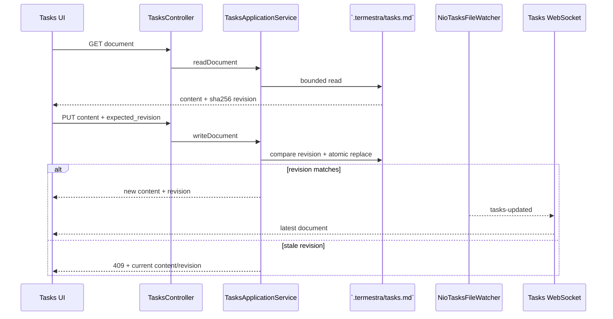

# 关键运行流程

本文把最容易跨上下文的流程串成可追踪路径。类名是定位入口，不是要求调用方
绕过 application interface。

## 创建 Workspace 与 Orchestrator

```mermaid
sequenceDiagram
    participant UI as Browser UI
    participant W as WorkspaceRegistrationService
    participant WR as WorkspaceRegistrationLedger
    participant T as TasksDocumentStore
    participant E as Agent Execution
    participant C as Configuration
    participant DB as SQLite

    UI->>W: RegisterWorkspaceCommand + registration_id
    W->>W: resolve canonical path + path single-flight
    W->>WR: reserve preparing Workspace + intent
    WR->>DB: commit registration attempt
    W->>WR: mark source ready (legacy-compatible phase; no Git inspection/mutation)
    W->>T: initialize `.termestra/` files
    T-->>W: tasks.md + refreshed PROTOCOL.md
    W->>WR: atomically activate Workspace + complete attempt
    alt new Workspace
        W->>E: configure Orchestrator launch intent
        E->>C: resolve preset + model capability + revision
        E->>DB: persist final Launch Configuration snapshot
    end
    alt new Workspace and autostart enabled
        W->>E: start Orchestrator
        E->>DB: persist Run
        E->>E: activate PTY and schedule startup/recovery input
    end
    W-->>UI: Workspace + orchestrator_start
```

同一规范路径的并发注册由引用计数 path single-flight 和数据库唯一约束收敛为一个
Workspace。注册沿用目录当前 checkout，不扫描或切换 Git 分支；元数据初始化失败时只
释放 `preparing` Workspace。Workspace 激活后才准备
Orchestrator，因此 Orchestrator 失败不会删除已经有效的 Workspace。若准备失败前尚未
写入 Launch Configuration，重复注册只补齐缺失配置；已有配置时保持 no-op，避免覆盖
快照或重复启动 Run。

创建 Worker 时，`preset` 走相同解析路径；`inherit_orchestrator` 则在单个 SQLite
事务内校验来源 revision 并复制其最终命令、参数、环境、preset、model 与恢复元数据。
这是创建时快照，不是后续联动配置。

`AgentExecutionService` 在持久化并激活交互式 PTY 后返回 Run，由每 Run 一次的后台任务
完成启动或恢复输入。创建响应的 `agent_start.ok`（Workspace 对应 `orchestrator_start.ok`）
表示进程创建请求已接受，不表示 CLI 已能接收任务。`CreateWorkerService` 在启动请求返回后
重新读取成员状态；若成员已被并发删除，返回 `TeamConflict`（HTTP 409）。启动失败不会
删除已保存的 Worker，用户可以查看失败输出、重试或删除。

Run 在提示识别和启动/恢复输入完整提交（含 Enter）前保持 `starting`；原生 session
恢复只等待就绪，不重复注入启动或恢复文本。`startup_phase` 区分 `initializing`、
`waiting_for_user`、`ready` 和 `failed`。当前确认、登录或初始化选择页进入人工等待：
后台等待期间保留 PTY，浏览器可人工完成操作，Termestra 不向该页面自动提交指令。
识别使用当前输入区域及 VT 样式：Hermes 的斜体 placeholder、Claude/Codex 的 dim
placeholder 与普通草稿区分，用户按 Home 或重绘草稿不会使输入区变为就绪。
可见历史即使引用完整 trust/login 页面，也不能覆盖下方已验证的当前 composer；
没有当前 composer 证据的登录/确认页仍等待用户操作。
忙碌提示只取当前输入框下方状态区或紧邻输入框的带样式 spinner，Codex loading
只取初始 banner 的字段；正文引用这些提示不会阻塞后续输入。
识别到当前输入框稳定后才继续后台输入；非用户等待的初始化累计上限为 120 秒，整个
启动等待上限为 10 分钟。停止、删除或服务关闭会取消后台启动输入。

启动输入提交完成后，进入 `running` 的持久化转换仍需重新获取 Agent 协调锁。
锁竞争只重试该转换，不重复发送输入；重试预算为 60 秒，最多额外等待一次协调锁获取窗口。
其他错误按启动失败处理；停止、删除和服务关闭会中断等待，并阻止旧 Run 恢复运行。

Team 的运行状态适配器只把 `running` Run 用于 `idle/working` 投影。Run 仍在 `starting`
时，自动输入返回内部 typed `deferred`，保证尚未尝试 PTY 写入。已入 outbox 的 Delivery
通过 `deferDeliveryClaim` 延后处理，不消耗五次失败重试额度，避免初始化或人工确认尚未
结束就耗尽重试。若 Agent 已无 active Run，且最新 retained Run 为启动失败，派单返回
普通失败，不自动新建 Run；用户显式启动仍可重试。这项保护只覆盖进程内尚保留的失败
证据。输入可能触达 PTY 时仍使用 `uncertain`，禁止自动重试。

Cursor 内置预设使用 `--force --trust`，信任用户已注册的 Workspace。schema v33 只升级
仍为默认 `--force` 的内置 Cursor 策略，递增 preset revision，保留用户自定义策略与参数；
已有、允许 preset augmentation 的 Launch Configuration 在下次启动时同样获得该参数。
schema v34 另外修复已固化参数的内置 Cursor 默认快照：在默认预设策略仍有效时，仅对
`cursor-agent --force`（可带已记录的显式 `--model`）追加 `--trust` 并递增 Launch
Configuration revision。自定义命令、额外参数、显式 startup 与已带 `--trust` 的快照保留
原样；该一次性兼容修复不恢复快照与预设的后续联动。
`InteractiveOutputTail` 随输出到达更新有界 VT 屏幕和提示识别状态，
`InteractiveInputSubmitter` 等待当前屏幕中的输入框，不再使用“三秒后自动放行”的兜底。
Hermes 支持光标位于占位文字前的输入框；Claude、Codex、Antigravity 的确认页按渲染后的
屏幕识别，Cursor 与 OpenCode 沿用各自输入框特征。OpenCode 会话页不提供首页的
`Ask anything...` 占位提示，后续输入通过当前空白输入区的三行边界、Agent/模型行、底部边界和
输入起点光标共同识别；向上延伸的多行输入区仍按草稿处理，草稿、忙碌提示和移出
输入区的光标不放行自动输入。透明主题将底边绘制为空格，此时还必须观察到紧邻下方的
命令快捷键提示行，不把任意缺失边界当作就绪。
首页同时识别三个点与单字符省略号的提示语。`OpenCodeInputRecognitionTest` 覆盖两种主题的
连续派单、真实 OpenCode 输出中的生成状态、窗口缩放、权限弹窗与终端重绘。
Pi 仅保留本次 Run 已观察到的 CLI
身份，是否可输入仍由当前屏幕决定，避免横幅重绘后漏检或把旧的就绪状态用于新派单。
输入行的绘制版本区分相同内容的重新绘制与旧提示；人工输入后必须观察新的输入框证据，
标题更新、纯光标移动和浏览器终端查询响应不会作为用户编辑或新输入框。
识别回归样本覆盖这些 CLI 的实际终端输出及不同分块。

## 可靠派单

```mermaid
sequenceDiagram
    participant O as Orchestrator `team` CLI
    participant Team as TeamApplicationService
    participant Ledger as TeamLedger
    participant Runtime as DispatchDeliveryRuntime
    participant Delivery as DispatchDeliveryApplicationService
    participant Exec as Agent Execution
    participant PTY as Worker PTY

    O->>Team: send(worker, task, idempotency_key)
    Team->>Team: authenticate role + validate limits
    Team->>Ledger: enqueue Dispatch + Message + Delivery
    Ledger-->>Team: committed dispatch_id
    Team->>Runtime: wake after commit
    Team-->>O: 202 accepted
    Runtime->>Delivery: processNext()
    Delivery->>Ledger: claim ready Delivery + attempt lease
    Delivery->>Exec: deliver committed Dispatch
    Exec->>PTY: prompt-aware automatic input
    alt complete input accepted
        Exec-->>Delivery: forwarded
        Delivery->>Ledger: Delivery submitted + Dispatch submitted
    else startup still pending
        Exec-->>Delivery: deferred, input_attempted=false
        Delivery->>Ledger: defer claim without consuming failure retry budget
    else proven no input
        Exec-->>Delivery: failed, input_attempted=false
        Delivery->>Ledger: bounded retry_wait or failed
    else input may have reached PTY
        Exec-->>Delivery: uncertain
        Delivery->>Ledger: uncertain; no automatic retry
    end
```

Worker `report` 或 Orchestrator `cancel` 可以终结公开 Dispatch，并关闭 Delivery；
迟到的投递确认不能复活终态。完整状态机和恢复分类见
[可靠派单设计](../design/reliable-dispatch.md)。

## 打开 Terminal Viewer

```mermaid
sequenceDiagram
    participant UI as xterm client
    participant WS as TerminalWebSocketHandler
    participant Mirror as HeadlessTerminalMirror
    participant Exec as Agent Execution
    participant PTY as PTY output

    UI->>WS: connect `/io` with clientId
    WS->>Exec: open Run output
    Exec-->>WS: bounded snapshot + live subscription
    PTY-->>Exec: output bytes
    Exec-->>WS: ordered decoded output
    WS->>Mirror: apply snapshot and queued live output
    UI->>WS: connect `/control`
    WS-->>UI: restore snapshot + cursor handoff
    WS-->>UI: live text frames
    UI->>WS: output_ack(bytes)
    Note over WS,Exec: slow viewers create pressure; all viewers clear before Run resumes
```

IO 和 Control 必须成对绑定同一 `clientId`。关闭 viewer 只清理该连接和 flow
lease；`stop` control message 才请求终止 Run。

## 编辑 Tasks Document



本地编辑器修改和浏览器修改使用同一文件权威。文件 watcher 只在有订阅者时
存在，最后一个订阅者断开或 Workspace 删除时关闭。

## 重启恢复

后端重启后的恢复顺序是：

1. 打开数据目录并把 SQLite schema 迁移到 v34；
2. 恢复 Workspace Registration：尚未开始元数据初始化的 `reserved` 可安全失败释放；
   旧版本遗留的 `switching/uncertain` 保留诊断证据但失败并释放路径 claim；已记录
   `checkout_applied` 的注册继续初始化元数据并激活；
3. 将未完成的旧 Run 标记为 terminal/stale；活进程不会自动重新收编；
4. 把遗留 `delivering` Delivery 隔离为 `uncertain`，恢复 `pending` 和到期
   `retry_wait`；
5. 用户再次启动 Agent 时优先恢复 provider-native session，否则注入有界恢复
   摘要；
6. Browser 重连时重建 Terminal mirror、Tasks watcher 和所有 viewer 投影。

## 删除 Workspace 或 Worker

删除是“持久状态优先”的补偿流程：

1. 在精确 Workspace/Agent 协调锁下提交 SQLite 图删除；
2. 停止并遗忘匹配 Run，撤销 credential；
3. 清理 Terminal output subscription、Tasks watcher、pending projection 与
   optimistic UI state；
4. 保留用户的 Workspace 目录、源文件和普通工具进程。

SQLite 事务失败时第一步整体回滚；后续运行时清理失败会被监督重试或记录，不能
撤销已经完成的权威删除。
