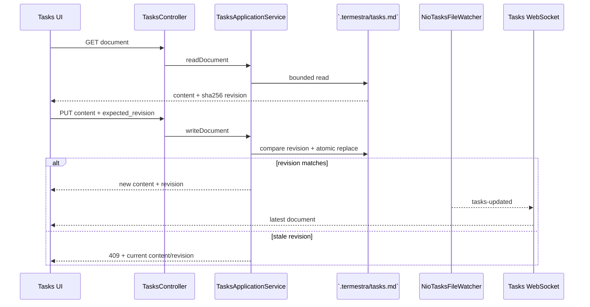

# 关键运行流程

本文把最容易跨上下文的流程串成可追踪路径。类名是定位入口，不是要求调用方
绕过 application interface。

## 创建 Workspace 与 Orchestrator

```mermaid
sequenceDiagram
    participant UI as Browser UI
    participant W as WorkspaceRegistrationService
    participant WR as WorkspaceRegistrationLedger
    participant T as TasksDocumentStore
    participant E as Agent Execution
    participant C as Configuration
    participant DB as SQLite

    UI->>W: RegisterWorkspaceCommand + registration_id
    W->>W: resolve canonical path + path single-flight
    W->>WR: reserve preparing Workspace + intent
    WR->>DB: commit registration attempt
    W->>WR: mark source ready (legacy-compatible phase; no Git inspection/mutation)
    W->>T: initialize `.termestra/` files
    T-->>W: tasks.md + refreshed PROTOCOL.md
    W->>WR: atomically activate Workspace + complete attempt
    alt new Workspace
        W->>E: configure Orchestrator launch intent
        E->>C: resolve preset + model capability + revision
        E->>DB: persist final Launch Configuration snapshot
    end
    alt new Workspace and autostart enabled
        W->>E: start Orchestrator
        E->>DB: persist Run
        E->>E: activate PTY and inject startup/recovery input
    end
    W-->>UI: Workspace + orchestrator_start
```

同一规范路径的并发注册由引用计数 path single-flight 和数据库唯一约束收敛为一个
Workspace。注册沿用目录当前 checkout，不扫描或切换 Git 分支；元数据初始化失败时只
释放 `preparing` Workspace。Workspace 激活后才准备
Orchestrator，因此 Orchestrator 失败不会删除已经有效的 Workspace。若准备失败前尚未
写入 Launch Configuration，重复注册只补齐缺失配置；已有配置时保持 no-op，避免覆盖
快照或重复启动 Run。

创建 Worker 时，`preset` 走相同解析路径；`inherit_orchestrator` 则在单个 SQLite
事务内校验来源 revision 并复制其最终命令、参数、环境、preset、model 与恢复元数据。
这是创建时快照，不是后续联动配置。

## 可靠派单

```mermaid
sequenceDiagram
    participant O as Orchestrator `team` CLI
    participant Team as TeamApplicationService
    participant Ledger as TeamLedger
    participant Runtime as DispatchDeliveryRuntime
    participant Delivery as DispatchDeliveryApplicationService
    participant Exec as Agent Execution
    participant PTY as Worker PTY

    O->>Team: send(worker, task, idempotency_key)
    Team->>Team: authenticate role + validate limits
    Team->>Ledger: enqueue Dispatch + Message + Delivery
    Ledger-->>Team: committed dispatch_id
    Team->>Runtime: wake after commit
    Team-->>O: 202 accepted
    Runtime->>Delivery: processNext()
    Delivery->>Ledger: claim ready Delivery + attempt lease
    Delivery->>Exec: deliver committed Dispatch
    Exec->>PTY: prompt-aware automatic input
    alt complete input accepted
        Exec-->>Delivery: forwarded
        Delivery->>Ledger: Delivery submitted + Dispatch submitted
    else proven no input
        Exec-->>Delivery: failed, input_attempted=false
        Delivery->>Ledger: bounded retry_wait or failed
    else input may have reached PTY
        Exec-->>Delivery: uncertain
        Delivery->>Ledger: uncertain; no automatic retry
    end
```

Worker `report` 或 Orchestrator `cancel` 可以终结公开 Dispatch，并关闭 Delivery；
迟到的投递确认不能复活终态。完整状态机和恢复分类见
[可靠派单设计](../design/reliable-dispatch.md)。

## 打开 Terminal Viewer

```mermaid
sequenceDiagram
    participant UI as xterm client
    participant WS as TerminalWebSocketHandler
    participant Mirror as HeadlessTerminalMirror
    participant Exec as Agent Execution
    participant PTY as PTY output

    UI->>WS: connect `/io` with clientId
    WS->>Exec: open Run output
    Exec-->>WS: bounded snapshot + live subscription
    PTY-->>Exec: output bytes
    Exec-->>WS: ordered decoded output
    WS->>Mirror: apply snapshot and queued live output
    UI->>WS: connect `/control`
    WS-->>UI: restore snapshot + cursor handoff
    WS-->>UI: live text frames
    UI->>WS: output_ack(bytes)
    Note over WS,Exec: slow viewers create pressure; all viewers clear before Run resumes
```

IO 和 Control 必须成对绑定同一 `clientId`。关闭 viewer 只清理该连接和 flow
lease；`stop` control message 才请求终止 Run。

## 编辑 Tasks Document



本地编辑器修改和浏览器修改使用同一文件权威。文件 watcher 只在有订阅者时
存在，最后一个订阅者断开或 Workspace 删除时关闭。

## 重启恢复

后端重启后的恢复顺序是：

1. 打开数据目录并把 SQLite schema 迁移到 v32；
2. 恢复 Workspace Registration：尚未开始元数据初始化的 `reserved` 可安全失败释放；
   旧版本遗留的 `switching/uncertain` 保留诊断证据但失败并释放路径 claim；已记录
   `checkout_applied` 的注册继续初始化元数据并激活；
3. 将未完成的旧 Run 标记为 terminal/stale；活进程不会自动重新收编；
4. 把遗留 `delivering` Delivery 隔离为 `uncertain`，恢复 `pending` 和到期
   `retry_wait`；
5. 用户再次启动 Agent 时优先恢复 provider-native session，否则注入有界恢复
   摘要；
6. Browser 重连时重建 Terminal mirror、Tasks watcher 和所有 viewer 投影。

## 删除 Workspace 或 Worker

删除是“持久状态优先”的补偿流程：

1. 在精确 Workspace/Agent 协调锁下提交 SQLite 图删除；
2. 停止并遗忘匹配 Run，撤销 credential；
3. 清理 Terminal output subscription、Tasks watcher、pending projection 与
   optimistic UI state；
4. 保留用户的 Workspace 目录、源文件和普通工具进程。

SQLite 事务失败时第一步整体回滚；后续运行时清理失败会被监督重试或记录，不能
撤销已经完成的权威删除。
