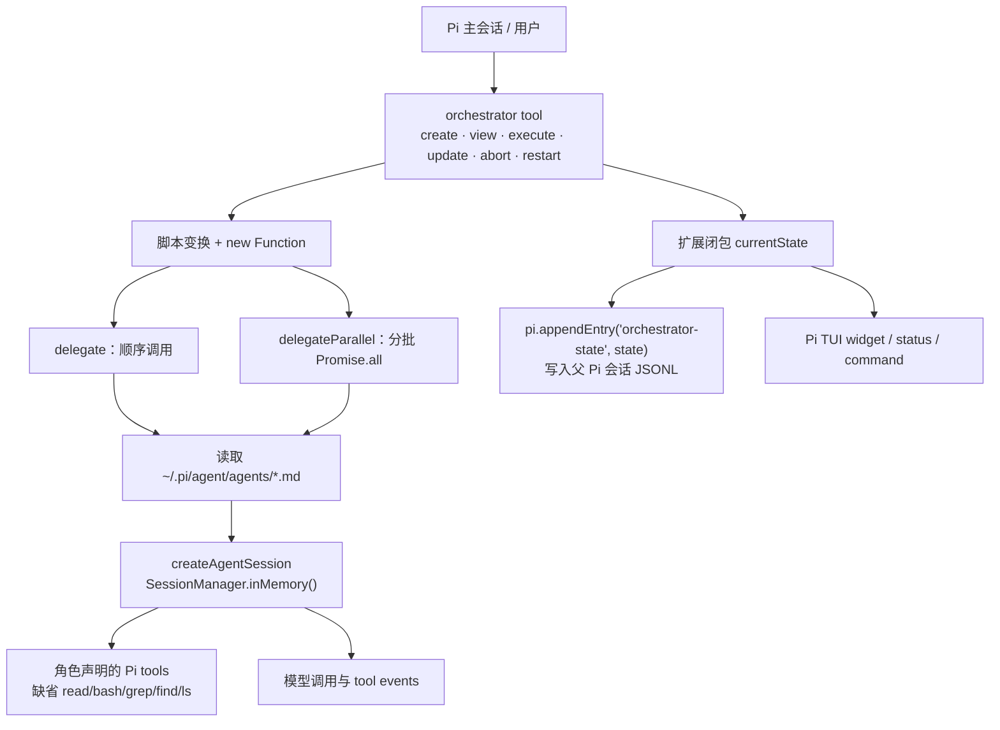

# `pi-orchestrator` 架构调研与 Termestra 适用性评估

> 状态：研究记录，不是 ADR  
> 调研日期：2026-08-11  
> 主对象源码快照：[`nkyriazis/pi-orchestrator@ec52bcd`](https://github.com/nkyriazis/pi-orchestrator/tree/ec52bcdbe2242e3872053dc8646874c47e69cdaf)  
> 发布包：[`@nkyriazis/pi-orchestrator` 1.0.0](https://pi.dev/packages/%40nkyriazis/pi-orchestrator?page=62)

> 本文只评估固定的外部源码快照，不定义 Termestra 当前行为。当前架构以
> [`../architecture/`](../architecture/README.md) 和已接受 ADR 为准。

## 结论先行

本报告把精确包名 **`@nkyriazis/pi-orchestrator` 1.0.0** 作为主对象。它是 Pi 包目录收录的第三方扩展，不是 Earendil/Pi 主仓库的官方编排器；Pi 包目录也明确提示第三方 Pi 包可以执行代码、影响 agent 行为，安装前应审查源码。[Pi 包目录列出的版本、作者、扩展类型、0 个直接依赖与 5 个 peer dependencies](https://pi.dev/packages/%40nkyriazis/pi-orchestrator?page=62)与仓库清单一致，[仓库清单](https://github.com/nkyriazis/pi-orchestrator/blob/ec52bcdbe2242e3872053dc8646874c47e69cdaf/package.json#L1-L33)则把入口直接指向 TypeScript 扩展源码。

对 Termestra 的两个问题必须分开回答：

| 问题 | 结论 | 理由 |
| --- | --- | --- |
| 能否作为依赖直接集成？ | **Reject** | 它不是服务或通用 SDK，而是与 Pi `ExtensionAPI`、`SessionManager`、TUI 和模型注册表紧耦合、运行在 Pi 主进程内的 TypeScript 扩展；Termestra 是 Java 21 模块化单体，且已有 SQLite 权威状态、Team/Dispatch、Agent Execution 和流式读模型边界。 |
| 是否值得移植设计思想？ | **选择性 Adopt/Adapt** | “先形成可审阅计划、再执行”“显式串行/并行 delegate”“角色声明工具集合”“实时步骤可视化”值得保留；任意脚本执行、同进程子 agent、提示词式审批、会话 JSONL 快照充当耐久状态等实现必须拒绝或重做。 |

综合判断：**不引入 npm 包，不在生产链路启动它作为 Pi sidecar；只把少量交互与派工概念翻译成 Team/Dispatch 内的轻量模型、SQLite 事务和受控执行端口，不恢复通用 Workflow 自动化。** 这也符合 Termestra 的 [架构基线](../adr/0001-architecture-baseline.md)、[package-by-feature 模块化单体](../adr/0002-package-by-feature-modular-monolith.md)和[有界读模型与流](../adr/0003-bounded-read-models-and-streams.md)。

## 1. 身份排歧与研究范围

`pi-orchestrator` 至少会指向三个不同项目。名称相近不代表能力相同，本报告不在它们之间互相借用能力：

| 项目 | 身份 | 本报告中的位置 |
| --- | --- | --- |
| [`@nkyriazis/pi-orchestrator` 1.0.0](https://pi.dev/packages/%40nkyriazis/pi-orchestrator?page=62) | 精确 npm 包名；第三方 Pi 扩展；“code-guided durable execution” | **主评估对象** |
| [`@onlinechefgroep/pi-agent-orchestrator` 0.18.0](https://www.npmjs.com/package/@onlinechefgroep/pi-agent-orchestrator/v/0.18.0) | 近名第三方 Pi 扩展；包含 queue、worktree、swarm、schedule、handoff 等更完整能力 | 只作成熟度和设计覆盖面的对照，绝不把这些能力归给主对象；其[清单](https://github.com/OnlineChefGroep/pi-agent-orchestrator/blob/main/package.json)与[架构文档](https://github.com/OnlineChefGroep/pi-agent-orchestrator/blob/main/docs/architecture.md)是对照来源 |
| 历史 [`@earendil-works/pi-orchestrator` 0.80.10](https://github.com/earendil-works/pi/blob/9e7582aa03e54f410fa9688197a3b64514e93400/packages/orchestrator/package.json#L1-L45) | Pi 主仓库曾用的实验性进程/会话服务器包 | 只作官方命名演进背景；2026-07-21 已在[官方提交](https://github.com/earendil-works/pi/commit/8495f9d0d6407d4ec94e16a685df70740335dd29)中改名为 `@earendil-works/pi-server`，不是本报告主对象 |

选择主对象的依据是精确包名和 Pi 官方包目录的安装条目，而不是二手文章。这里还有一个上游元数据不一致：可访问且由 Pi 包目录链接的仓库是 [`github.com/nkyriazis/pi-orchestrator`](https://github.com/nkyriazis/pi-orchestrator)，但其 [`package.json` 的 `repository.url`](https://github.com/nkyriazis/pi-orchestrator/blob/ec52bcdbe2242e3872053dc8646874c47e69cdaf/package.json#L17-L20) 写成了 `github.com/kyriazis/pi-orchestrator.git`。后者当前不是可确认的规范仓库地址，因此本文以实际可访问仓库和 npm scope `@nkyriazis` 为准。

研究采用的主对象版本为 npm 1.0.0。发布包源文件与上述仓库快照中的 `extensions/*.ts` 一致；仓库 HEAD 只在发布后继续修改过 README，因此涉及行为的结论全部指向具体源码提交，而不是依赖浮动的 `main` 分支。

## 2. 包形态、版本与宿主依赖

### 2.1 它是什么

它是一个 Pi extension package：

- `name`/`version` 为 `@nkyriazis/pi-orchestrator`/`1.0.0`；`main` 直接是 `extensions/index.ts`，Pi manifest 声明加载 `./extensions`。[package.json L1-L6、L29-L33](https://github.com/nkyriazis/pi-orchestrator/blob/ec52bcdbe2242e3872053dc8646874c47e69cdaf/package.json#L1-L33)
- 包没有稳定的领域 API、HTTP API、RPC 协议或独立 daemon 入口。默认导出接收 Pi 的 `ExtensionAPI`，随后注册一个名为 `orchestrator` 的 tool 和一个同名 TUI command。[index.ts L737-L752、L981-L987](https://github.com/nkyriazis/pi-orchestrator/blob/ec52bcdbe2242e3872053dc8646874c47e69cdaf/extensions/index.ts#L737-L752)
- 官方安装方式是 `pi install npm:@nkyriazis/pi-orchestrator`，由 Pi 加载 manifest 资源，不是 Maven/Java 依赖，也不是供外部进程调用的服务。[Pi 包目录](https://pi.dev/packages/%40nkyriazis/pi-orchestrator?page=62)

### 2.2 宿主与供应链边界

清单声明 5 个通配 peer dependencies：`@earendil-works/pi-ai`、`pi-agent-core`、`pi-coding-agent`、`pi-tui` 和 `typebox` 均为 `"*"`；没有 `engines`、构建脚本、测试脚本或 lockfile。[package.json L22-L33](https://github.com/nkyriazis/pi-orchestrator/blob/ec52bcdbe2242e3872053dc8646874c47e69cdaf/package.json#L22-L33) 发布 workflow 使用 Node 22，但这只是发布 job 的环境，并未形成消费者兼容约束。[publish.yml L14-L26](https://github.com/nkyriazis/pi-orchestrator/blob/ec52bcdbe2242e3872053dc8646874c47e69cdaf/.github/workflows/publish.yml#L14-L26)

因此无法从包清单回答“支持哪些 Pi 版本”，也没有证据表明其内部 API 导入在未来 Pi 版本上兼容。即使 Termestra 增加 Node sidecar，也仍需先自建 Pi 宿主、配置模型认证和 agent Markdown、再发明对外控制协议；这已经不是“直接集成该依赖”，而是新增另一套运行时。

## 3. 实际架构



这张图中的所有节点都在 Pi 扩展宿主内。主对象没有子进程管理器、PTY、独立 agent daemon、网络 transport、数据库或前后端分层。`runDelegateSdk()` 直接调用 Pi SDK 的 `createAgentSession()`，并显式传入 `SessionManager.inMemory()`；Pi 源码将该 factory 定义为“no file persistence”。[主对象 index.ts L78-L150](https://github.com/nkyriazis/pi-orchestrator/blob/ec52bcdbe2242e3872053dc8646874c47e69cdaf/extensions/index.ts#L78-L150) [Pi SessionManager L1567-L1570](https://github.com/earendil-works/pi/blob/9e7582aa03e54f410fa9688197a3b64514e93400/packages/coding-agent/src/core/session-manager.ts#L1567-L1570)

### 3.1 核心抽象

| 抽象 | 实际含义 | 缺失的生产级语义 |
| --- | --- | --- |
| `OrchestratorState` | 一个扩展闭包中的可变对象：脚本、delegate 记录、输出历史、状态、日志和最终结果。[index.ts L24-L53](https://github.com/nkyriazis/pi-orchestrator/blob/ec52bcdbe2242e3872053dc8646874c47e69cdaf/extensions/index.ts#L24-L53) | 无 schema version、plan/run/attempt ID、revision、optimistic lock、approval 证据或 owner/tenant。 |
| `DelegateCallRecord` | 一次动态 delegate 调用的 UI/结果记录；状态为 `pending/running/completed/error`。[index.ts L39-L53](https://github.com/nkyriazis/pi-orchestrator/blob/ec52bcdbe2242e3872053dc8646874c47e69cdaf/extensions/index.ts#L39-L53) | 不是可恢复任务；无依赖、重试策略、deadline、budget、artifact、lease 或 checkpoint。 |
| `AgentConfig` | 从 Markdown frontmatter 读取 name、description、tools、model、systemPrompt。[agents.ts L9-L19、L26-L63](https://github.com/nkyriazis/pi-orchestrator/blob/ec52bcdbe2242e3872053dc8646874c47e69cdaf/extensions/agents.ts#L9-L63) | 无能力签名、凭据范围、隔离级别或策略版本。 |
| orchestration script | 由模型/用户提供、在运行时执行的 JavaScript 控制流，注入 `delegate`、`delegateParallel`、`consoleLog`、`finish`。[index.ts L659-L718](https://github.com/nkyriazis/pi-orchestrator/blob/ec52bcdbe2242e3872053dc8646874c47e69cdaf/extensions/index.ts#L659-L718) | 不是经过类型检查、验证或沙箱化的 workflow IR。README 称它为 TypeScript，但包中没有编译步骤，`new Function()` 只能直接解析 JavaScript 语法。 |

`variables`、`currentCall`、静态 `parseDelegateCalls()` 和 line-map 返回值在当前执行路径中没有形成恢复机制；动态调用总是按 `state.delegateCalls.length` 分配新槽位。[parseDelegateCalls L279-L303](https://github.com/nkyriazis/pi-orchestrator/blob/ec52bcdbe2242e3872053dc8646874c47e69cdaf/extensions/index.ts#L279-L303) [delegate L508-L525](https://github.com/nkyriazis/pi-orchestrator/blob/ec52bcdbe2242e3872053dc8646874c47e69cdaf/extensions/index.ts#L508-L525)

## 4. 进程、会话、角色与任务调度

### 4.1 进程与会话模型

一次 `delegate()` 不会启动独立 Pi 进程。它在当前扩展进程中创建一个新的 SDK session，复用父级 `modelRegistry` 和工作目录，使用内存 `SessionManager`，prompt 完成后 dispose。[index.ts L78-L150](https://github.com/nkyriazis/pi-orchestrator/blob/ec52bcdbe2242e3872053dc8646874c47e69cdaf/extensions/index.ts#L78-L150)

DSL 的 `session` 字符串也不是可恢复的 Pi 会话标识。实现只把同 key 以前的**最终文本输出**拼接进下一次新 session 的 system prompt；原始消息、tool calls、tool results、模型状态和 session tree 都不会延续。[index.ts L101-L117、L543-L558](https://github.com/nkyriazis/pi-orchestrator/blob/ec52bcdbe2242e3872053dc8646874c47e69cdaf/extensions/index.ts#L101-L117) 因而 README 中“same session remembers prior turns”应理解为文本摘要式上下文注入，而不是同一 runtime/session 的继续执行。

这个做法还有额外信任问题：前一 delegate 的模型输出未经结构校验就被提升到下一 delegate 的 **system prompt**，可能把 prompt injection 或错误指令提升到更高优先级；`sessionHistory` 又保存完整输出、没有 token/byte/entry 上限。[index.ts L101-L107、L543-L558](https://github.com/nkyriazis/pi-orchestrator/blob/ec52bcdbe2242e3872053dc8646874c47e69cdaf/extensions/index.ts#L101-L107) Termestra 不应复制这种“输出即系统指令”的上下文复用方式。

所有 delegate 共用 `ctx.cwd`；没有 worktree、容器、文件系统分区或每个 agent 的环境/凭据裁剪。[index.ts L480-L489、L545-L547](https://github.com/nkyriazis/pi-orchestrator/blob/ec52bcdbe2242e3872053dc8646874c47e69cdaf/extensions/index.ts#L480-L489) “isolated context”只成立于模型会话上下文，不成立于 OS 权限、文件系统或进程边界。

### 4.2 Agent/role

角色来自 `~/.pi/agent/agents/*.md`。虽然 discovery helper 能发现 project scope 并定义 project-over-user 覆盖规则，[agents.ts L76-L105](https://github.com/nkyriazis/pi-orchestrator/blob/ec52bcdbe2242e3872053dc8646874c47e69cdaf/extensions/agents.ts#L76-L105)，实际执行固定调用 `discoverAgents(cwd, "user")`，所以当前 orchestrator 不使用项目级角色。[index.ts L480-L490](https://github.com/nkyriazis/pi-orchestrator/blob/ec52bcdbe2242e3872053dc8646874c47e69cdaf/extensions/index.ts#L480-L490)

角色可指定模型和 tools；模型不可用时回退父模型，tools 缺省时自动给出 `read`、`bash`、`grep`、`find`、`ls`。[index.ts L56-L75、L88-L117](https://github.com/nkyriazis/pi-orchestrator/blob/ec52bcdbe2242e3872053dc8646874c47e69cdaf/extensions/index.ts#L56-L117) 这是易用性默认值，不是最小权限默认值。

### 4.3 与 Termestra 可见成员语义不兼容

Pi delegate 是扩展进程内临时创建的隐形 SDK session：它不持久化为 Termestra `TeamMember`，不会出现在成员卡片或 `team list`，也没有 Termestra 的 `dispatch_id`、`team report`、`team cancel` 和 `idle/working/stopped` 生命周期。主对象只有内存 `DelegateCallRecord`，且没有 crew/swarm 成员模型。[主对象状态模型](https://github.com/nkyriazis/pi-orchestrator/blob/ec52bcdbe2242e3872053dc8646874c47e69cdaf/extensions/index.ts#L24-L53) [SDK session 创建](https://github.com/nkyriazis/pi-orchestrator/blob/ec52bcdbe2242e3872053dc8646874c47e69cdaf/extensions/index.ts#L78-L150)

Termestra 已明确规定 orchestrator 必须先 `team list`、用 `team send` 派给用户管理的真实成员、方向变化时按 dispatch ID 取消，并且不得用 CLI 内置 subagent/workflow/background agent 代替 Termestra 成员；worker 也被告知自己是 UI 中的真实 CLI worker，而不是内置 subagent。[`AgentStartupPrompt.java` L23-L31、L53-L56](../../backend/src/main/java/dev/termestra/execution/application/service/AgentStartupPrompt.java)

现有一键组队路径也已经给出正确顺序：`TeamScenarioApplicationService` 先持久化每个可见成员及其 launch config，再并行启动成员，最后把 roster/goal 交给 Orchestrator，要求它 `team list` 后显式派单。[`TeamScenarioApplicationService.java` L38-L83、L114-L127](../../backend/src/main/java/dev/termestra/team/application/service/TeamScenarioApplicationService.java) 因此未来若增加 auto crew，只能复用/深化这条显式成员路径；不能在 Pi 扩展内部悄悄创建 delegate 并把它们投影成 Termestra worker。

### 4.4 任务与调度

主对象没有 Task、Job、Queue、Dependency 或 Scheduler 聚合。控制流就是脚本自身：普通 `await delegate()` 串行；`delegateParallel()` 按 batch 执行 `Promise.all()`，缺省 `maxConcurrency = 4`。[index.ts L508-L657](https://github.com/nkyriazis/pi-orchestrator/blob/ec52bcdbe2242e3872053dc8646874c47e69cdaf/extensions/index.ts#L508-L657)

具体并发约束和风险：

- 同一 parallel batch 禁止重复 `session` key，可避免同 key 历史的直接覆盖；这是局部校验，不是资源隔离。[index.ts L561-L571](https://github.com/nkyriazis/pi-orchestrator/blob/ec52bcdbe2242e3872053dc8646874c47e69cdaf/extensions/index.ts#L561-L571)
- `maxConcurrency` 没有正整数校验。值为 `0` 时 `for (...; batch += maxConcurrency)` 不会前进；负数、非整数和过大值也没有明确契约。[index.ts L574-L598](https://github.com/nkyriazis/pi-orchestrator/blob/ec52bcdbe2242e3872053dc8646874c47e69cdaf/extensions/index.ts#L574-L598)
- 所有 parallel record 在真正进入 batch 前就被标成 `running`，所以排队中的后续 batch 在 UI 中也显示运行中。[index.ts L574-L590](https://github.com/nkyriazis/pi-orchestrator/blob/ec52bcdbe2242e3872053dc8646874c47e69cdaf/extensions/index.ts#L574-L590)
- `Promise.all()` fail-fast；SDK 调用抛错时没有每任务 `catch/finally`。其他 sibling 不会被该实现主动取消，可能继续运行并在 orchestration 已进入 error/已返回后修改共享状态。这是由 [parallel 实现 L596-L647](https://github.com/nkyriazis/pi-orchestrator/blob/ec52bcdbe2242e3872053dc8646874c47e69cdaf/extensions/index.ts#L596-L647)与[外层 catch L700-L718](https://github.com/nkyriazis/pi-orchestrator/blob/ec52bcdbe2242e3872053dc8646874c47e69cdaf/extensions/index.ts#L700-L718)推导出的逻辑竞态。
- 没有全局并发上限、队列公平性、provider rate limit、超时、重试、退避、预算或跨 orchestration admission control。

## 5. 工具系统与事件流

主对象本身只注册一个复合工具 `orchestrator`。其 actions 是 `create/view/execute/update/abort/restart`；参数 schema 只含 `action` 和可选 `script`。[index.ts L723-L735、L752-L854](https://github.com/nkyriazis/pi-orchestrator/blob/ec52bcdbe2242e3872053dc8646874c47e69cdaf/extensions/index.ts#L723-L735)

delegate 的工具集合由 agent Markdown 的 `tools` 字段传给 Pi `createAgentSession()`；扩展没有自己的 capability registry、工具参数策略、审批 hook、审计日志或 credential broker。[index.ts L109-L117](https://github.com/nkyriazis/pi-orchestrator/blob/ec52bcdbe2242e3872053dc8646874c47e69cdaf/extensions/index.ts#L109-L117) 它订阅 Pi session events，只拼接 assistant `text_delta` 并把 tool start/end 转成 UI 的 `currentStep`；tool 输入、tool 结果和完整事件序列不进入 orchestration 输出。[index.ts L130-L150](https://github.com/nkyriazis/pi-orchestrator/blob/ec52bcdbe2242e3872053dc8646874c47e69cdaf/extensions/index.ts#L130-L150)

界面更新通过 tool `onUpdate` 和 Pi TUI widget 完成。状态展示包含脚本行、delegate 状态、耗时、预览和 console tail，[widget L407-L476](https://github.com/nkyriazis/pi-orchestrator/blob/ec52bcdbe2242e3872053dc8646874c47e69cdaf/extensions/index.ts#L407-L476)；`/orchestrator` command 只把当前摘要显示在 Pi UI。[index.ts L981-L1000](https://github.com/nkyriazis/pi-orchestrator/blob/ec52bcdbe2242e3872053dc8646874c47e69cdaf/extensions/index.ts#L981-L1000) 这些是进程内 UI 通知，不是带游标、重放、背压或慢消费者策略的后端事件流。

## 6. 状态持久化、错误与恢复

### 6.1 持久化边界

唯一持久化调用是 `pi.appendEntry("orchestrator-state", currentState)`；启动时扫描父 Pi session entries，最后一个同类型 custom entry 覆盖闭包状态。[index.ts L737-L750](https://github.com/nkyriazis/pi-orchestrator/blob/ec52bcdbe2242e3872053dc8646874c47e69cdaf/extensions/index.ts#L737-L750) Pi 官方扩展契约说明 `appendEntry()` 把扩展数据写为 session custom entry，并可在 `session_start` 时恢复。[Pi extensions.md L1437-L1452](https://github.com/earendil-works/pi/blob/9e7582aa03e54f410fa9688197a3b64514e93400/packages/coding-agent/docs/extensions.md#L1437-L1452)

保存时点并不构成 durable execution：

- `create/update/restart/abort` 各追加一次完整状态；`execute` 只在开始前和整段脚本返回后追加。[index.ts L864-L970](https://github.com/nkyriazis/pi-orchestrator/blob/ec52bcdbe2242e3872053dc8646874c47e69cdaf/extensions/index.ts#L864-L970)
- 每个 delegate 完成时只修改内存并发出 UI update，没有 checkpoint。[delegate L508-L558](https://github.com/nkyriazis/pi-orchestrator/blob/ec52bcdbe2242e3872053dc8646874c47e69cdaf/extensions/index.ts#L508-L558)
- 每个 delegate 自身明确使用不落盘的 `SessionManager.inMemory()`。[index.ts L111-L117](https://github.com/nkyriazis/pi-orchestrator/blob/ec52bcdbe2242e3872053dc8646874c47e69cdaf/extensions/index.ts#L111-L117)
- 恢复后再次 `execute` 会从脚本开头运行；`delegate()` 总是新建 record 并实际调用 SDK，没有按已完成 call 跳过或 replay 的分支。[executeOrchestration L480-L558、L680-L705](https://github.com/nkyriazis/pi-orchestrator/blob/ec52bcdbe2242e3872053dc8646874c47e69cdaf/extensions/index.ts#L480-L558)

因此 README 对 `execute` 的“resumes from last completed call if interrupted”声明[README L171-L180](https://github.com/nkyriazis/pi-orchestrator/blob/ec52bcdbe2242e3872053dc8646874c47e69cdaf/README.md#L171-L180)与当前源码不一致。崩溃发生在长脚本中间时，最多恢复执行前的 `running` 快照，而不是已完成步骤；重新执行还可能重复有副作用的 tool calls。

此外，持久化对象没有版本和迁移；完整 task、result、session history、console logs 会反复附加到父会话，delegate 输出没有总量上限。这既不符合 Termestra 的 SQLite authority，也不符合“先数据库、后内存”的写入顺序：主对象先变更 `currentState`，之后才选择性 append。

### 6.2 错误、取消与恢复

- 脚本错误被外层 `catch` 转成 `state.status = "error"`，随后 tool 正常返回该 state，而不是抛出稳定的 typed error。[index.ts L700-L718、L932-L939](https://github.com/nkyriazis/pi-orchestrator/blob/ec52bcdbe2242e3872053dc8646874c47e69cdaf/extensions/index.ts#L700-L718)
- 顺序 delegate 中，`session.prompt()` 抛错时没有 `finally` 来保证 `session.dispose()`；正常路径才在 prompt 后 dispose。[index.ts L121-L150](https://github.com/nkyriazis/pi-orchestrator/blob/ec52bcdbe2242e3872053dc8646874c47e69cdaf/extensions/index.ts#L121-L150)
- Pi 传入 tool 的 `AbortSignal` 会传给 delegate session，信号触发时调用 `session.abort()`/`dispose()`；这是实际取消路径。[index.ts L121-L127](https://github.com/nkyriazis/pi-orchestrator/blob/ec52bcdbe2242e3872053dc8646874c47e69cdaf/extensions/index.ts#L121-L127)
- `action="abort"` 本身只把共享状态改为 `paused` 并持久化，没有保存或触发 AbortController，也没有让运行脚本检查 paused 状态。[index.ts L942-L947](https://github.com/nkyriazis/pi-orchestrator/blob/ec52bcdbe2242e3872053dc8646874c47e69cdaf/extensions/index.ts#L942-L947) 因而它不是可靠的运行中 pause/cancel 原语。
- 没有 crash recovery、lease reclaim、幂等键、重试分类、补偿或 exactly-once/at-least-once 语义。

## 7. 前后端边界与扩展点

主对象没有前后端边界：状态、执行、事件转换和 TUI 渲染都在一个扩展模块/进程中。它没有 HTTP route、WebSocket、Unix socket、DTO 版本、认证层或序列化协议。Termestra 不能通过现有 WebFlux adapter 调用它，也不能把它的 widget 当成现有前端读模型。

现有扩展点只有两类：

1. 任意脚本控制流：循环、条件、顺序与并行组合很灵活，但新增 DSL primitive 需要修改注入参数和实现；当前 line tracking 依靠逐行正则插入 `await __trackLine()`，不是 AST 变换，可能对合法 JavaScript/TypeScript 结构产生语义或语法影响。[index.ts L153-L277](https://github.com/nkyriazis/pi-orchestrator/blob/ec52bcdbe2242e3872053dc8646874c47e69cdaf/extensions/index.ts#L153-L277)
2. Markdown agent config：可以增加角色、system prompt、模型和工具名，但不能替换执行 backend、持久化 adapter、调度策略、隔离策略或 transport。[agents.ts L11-L19、L26-L65](https://github.com/nkyriazis/pi-orchestrator/blob/ec52bcdbe2242e3872053dc8646874c47e69cdaf/extensions/agents.ts#L11-L65)

对 Termestra 而言，这些不是可直接实现 hexagonal ports 的接口；必须先抽象成自己的领域命令、端口和 adapter。

## 8. 安全模型

### 8.1 上游信任边界

Pi 官方文档明确说明：Pi 以启动用户的权限运行，project trust 不是 sandbox；内置工具和 extensions 都可用同一用户权限读写文件、执行命令，真正的隔离需要 OS/容器/虚拟化边界。[Pi security.md L1-L41](https://github.com/earendil-works/pi/blob/9e7582aa03e54f410fa9688197a3b64514e93400/packages/coding-agent/docs/security.md#L1-L41) Pi 扩展文档也直接警告 extensions 可执行任意代码、拥有完整系统权限。[Pi extensions.md L109-L113](https://github.com/earendil-works/pi/blob/9e7582aa03e54f410fa9688197a3b64514e93400/packages/coding-agent/docs/extensions.md#L109-L113)

主对象没有在此基础上增加安全层：

- `executeOrchestration()` 用 `new Function()` 执行 orchestration script，未使用 `node:vm`、isolated worker、容器、AST allowlist 或 capability membrane。[index.ts L680-L704](https://github.com/nkyriazis/pi-orchestrator/blob/ec52bcdbe2242e3872053dc8646874c47e69cdaf/extensions/index.ts#L680-L704) 因此脚本在宿主 JavaScript 全局环境中运行；“只提供四个注入函数”不等于禁止访问 `globalThis`、`process`、网络或动态模块。这是从执行机制直接推导的安全结论。
- 角色未声明 tools 时默认包含 `bash`，而所有角色共享真实 cwd 和宿主权限。[index.ts L109-L117](https://github.com/nkyriazis/pi-orchestrator/blob/ec52bcdbe2242e3872053dc8646874c47e69cdaf/extensions/index.ts#L109-L117)
- 并行 agent 没有 worktree 或写入协调；两个带写工具的 agent 可以同时修改同一文件。
- 扩展复用父级 model registry/认证环境，没有 per-agent credential scope、network policy 或 secret broker。[index.ts L78-L117](https://github.com/nkyriazis/pi-orchestrator/blob/ec52bcdbe2242e3872053dc8646874c47e69cdaf/extensions/index.ts#L78-L117)
- 整段运行期间实现会覆写进程全局 `console.log`，finally 时再恢复；同进程其他扩展/宿主日志可能被截获进 orchestration state。[index.ts L659-L715](https://github.com/nkyriazis/pi-orchestrator/blob/ec52bcdbe2242e3872053dc8646874c47e69cdaf/extensions/index.ts#L659-L715)

### 8.2 “人工审批”并未由状态机强制

README 声称 orchestrator “enforces a review step”，agent 不能在同一 turn create 后 execute。[README L137-L146](https://github.com/nkyriazis/pi-orchestrator/blob/ec52bcdbe2242e3872053dc8646874c47e69cdaf/README.md#L137-L146) 源码实际只在 tool description/prompt guidelines 中要求模型展示计划并等待用户，[index.ts L808-L850](https://github.com/nkyriazis/pi-orchestrator/blob/ec52bcdbe2242e3872053dc8646874c47e69cdaf/extensions/index.ts#L808-L850)；`OrchestratorState` 没有 `approvedBy`、approval token、revision hash 或 turn ID，`execute` 分支也只检查 state 是否存在和是否已完成，随后立即运行。[index.ts L914-L935](https://github.com/nkyriazis/pi-orchestrator/blob/ec52bcdbe2242e3872053dc8646874c47e69cdaf/extensions/index.ts#L914-L935)

所以这是提示词约定，不是授权边界。Termestra 若需要人审，必须以持久化 plan revision + approval record + compare-and-set 的执行 gate 实现，不能依赖 agent 遵守描述文本。

## 9. README 声明与源码行为核对

| 声明 | 源码结论 | 评估 |
| --- | --- | --- |
| “durable execution” | 只把父扩展 state 在执行前/后追加到 Pi session；delegate session 全部 in-memory，中途无 step checkpoint。[持久化调用](https://github.com/nkyriazis/pi-orchestrator/blob/ec52bcdbe2242e3872053dc8646874c47e69cdaf/extensions/index.ts#L737-L750) [execute 保存点](https://github.com/nkyriazis/pi-orchestrator/blob/ec52bcdbe2242e3872053dc8646874c47e69cdaf/extensions/index.ts#L914-L935) | **不成立为工作流级 durability**；只能称“父会话中的粗粒度状态快照”。 |
| “resumes from last completed call” | 每次 execute 从头执行脚本，每个 delegate 总是新增 record 并调用 SDK，无 completed-call replay/skip。[runner](https://github.com/nkyriazis/pi-orchestrator/blob/ec52bcdbe2242e3872053dc8646874c47e69cdaf/extensions/index.ts#L480-L558) | **与实现不符**。 |
| “enforces review” | 仅 tool prompt 要求等待；没有批准状态或执行 gate。[guidelines](https://github.com/nkyriazis/pi-orchestrator/blob/ec52bcdbe2242e3872053dc8646874c47e69cdaf/extensions/index.ts#L808-L850) [execute](https://github.com/nkyriazis/pi-orchestrator/blob/ec52bcdbe2242e3872053dc8646874c47e69cdaf/extensions/index.ts#L914-L935) | **只是一项 agent 行为建议**。 |
| “TypeScript scripts” | 直接把字符串交给 `new Function()`；无 TypeScript parser/compiler dependency 或 build step。[executor](https://github.com/nkyriazis/pi-orchestrator/blob/ec52bcdbe2242e3872053dc8646874c47e69cdaf/extensions/index.ts#L680-L704) [manifest](https://github.com/nkyriazis/pi-orchestrator/blob/ec52bcdbe2242e3872053dc8646874c47e69cdaf/package.json) | **实际只可靠支持当前 Node 可解析的 JavaScript 子集**。 |
| “isolated context” | 模型会话是 fresh/in-memory，但共享 Pi 进程、cwd、用户权限与 model registry。[runDelegateSdk](https://github.com/nkyriazis/pi-orchestrator/blob/ec52bcdbe2242e3872053dc8646874c47e69cdaf/extensions/index.ts#L78-L150) | **仅上下文隔离，不是安全或文件隔离**。 |
| “abort/pause” | action 只写 `paused`；实际取消依赖外部 tool AbortSignal。[abort action](https://github.com/nkyriazis/pi-orchestrator/blob/ec52bcdbe2242e3872053dc8646874c47e69cdaf/extensions/index.ts#L942-L947) [signal handler](https://github.com/nkyriazis/pi-orchestrator/blob/ec52bcdbe2242e3872053dc8646874c47e69cdaf/extensions/index.ts#L121-L127) | **action 本身不是运行控制原语**。 |

这些差异使包不适合承担 Termestra 的事实来源、调度器或安全边界。

## 10. Termestra：直接集成依赖评估

| 维度 | `@nkyriazis/pi-orchestrator` | Termestra 约束 | 决策 |
| --- | --- | --- | --- |
| 运行时 | Pi/Node TypeScript 扩展，入口为 `.ts` | Java 21/Maven 模块化单体 | Reject direct dependency |
| 边界 | 进程内 tool + TUI，无服务协议 | WebFlux inbound adapter、明确 domain/application/outbound ports | Reject sidecar wrapping as default |
| 持久化 | 父 Pi JSONL custom entry；先内存、后偶发 append | SQLite authority；DB-first；事务后事件/outbox | Reject |
| Agent 状态 | draft/running/paused/completed/error + call 状态 | 公共 Agent 状态必须保持 `idle/working/stopped` | Reject direct projection；如借鉴需显式映射且不污染公共契约 |
| 调度 | 单脚本、局部 batch 并发 | 当前产品范围应深化 Team/Dispatch，并由 Agent Execution 承担运行边界；不恢复通用 Workflow 自动化 | Adapt into Team/Dispatch, not a workflow engine |
| 流 | TUI callback，无 replay/backpressure | summary/detail/stream、原子 snapshot+stream、有界缓冲和慢消费者策略 | Reject implementation |
| 安全 | 同用户权限、`new Function`、缺省 bash、无审批实体 | 应由 adapter/policy/OS isolation 控制工具、凭据、worktree 和进程 | Reject |
| 兼容性 | 5 个 `*` peer、无 engine/test/build contract | 可重复构建和集成验证 | Reject |

即使将整个 Pi 运行时作为 outbound sidecar，也要补齐 protocol、auth、生命周期、状态同步、版本固定、幂等和隔离，收益不足以抵消双运行时和双事实来源的复杂度。除非产品明确决定把“Pi 会话托管”设为新能力，否则不应走这条路径。

## 11. Adopt / Adapt / Reject

这里的 **Adopt** 只表示采纳概念或交互，不表示复制源码或增加 npm 依赖。

### Adopt：可直接接受的概念

1. **可审阅的 dispatch 工件**：先生成一份有限、可视的成员派工计划，再明确执行。Termestra 应把它落为 Team/Dispatch 内轻量的 `DispatchPlan`、`DispatchPlanRevision` 和 `Approval`，而不是运行字符串或通用工作流定义。
2. **显式串行与受限并行意图**：`delegate` 与 `delegateParallel` 的认知模型简单，适合映射成有限的 dispatch wave 与 join，不必引入通用 step graph。
3. **角色声明模型与工具集合**：角色拥有 system instruction、model preference、capability allowlist；这与 Team/Agent Execution 的职责分离兼容。
4. **实时步骤可见性**：running/completed/error、当前工具、耗时和结果摘要是有价值的 operator read model；应经 ADR-0003 的 bounded snapshot/stream 输出。

### Adapt：保留目的，重做机制

1. **脚本 DSL → 受限 dispatch plan**：使用 typed command 表达本次派工的角色、任务说明、有限并发 wave、join 和结果汇总；不支持任意宿主代码，也不顺势引入循环、条件分支、定时触发等通用 Workflow 语义。
2. **`session` key → 持久化 Context/Thread ID**：保存消息引用、上下文版本和产物，不把历史输出字符串拼进 system prompt 充当会话，更不能把下游模型输出提升为下一次 system instruction。
3. **batch 并发 → Team dispatch admission**：校验正整数 concurrency；加入 workspace/team/provider 限额、queue、fairness、deadline、budget、cancellation propagation 和 dispatch retry policy。
4. **custom entry → SQLite transaction**：每个 dispatch plan、delivery attempt 和 dispatch record 状态转换先提交数据库，再更新内存投影并从 after-commit/outbox 发布带 correlation ID 的事件。
5. **plan review → 强制 approval gate**：approval 绑定 plan revision/hash、actor、时间和作用域；执行用 compare-and-set 防止修改后沿用旧批准。
6. **agent tools → typed capability policy**：Team 负责角色意图，Agent Execution 在启动时求交集得到有效能力；凭据、网络和路径权限由 outbound adapter/沙箱裁剪。
7. **同 cwd 并行 → 可选 worktree/沙箱**：写 agent 默认单 writer；确需并行写时使用独立 worktree，合并作为显式步骤。

### Reject：不应进入 Termestra

1. 直接依赖或复制 `@nkyriazis/pi-orchestrator` 的运行时代码。
2. `new Function()` 执行模型生成脚本，或把 prompt guideline 当授权机制。
3. 同进程、同 cwd、同用户权限的“隔离”表述与缺省 `bash` 权限。
4. 以完整可变对象反复追加到 JSONL 代替领域持久化、checkpoint 和事件日志。
5. 先改内存再持久化、无 schema/version/lock 的状态模型。
6. 无验证的 `maxConcurrency`、fail-fast 后 sibling 继续运行、全局 `console.log` monkey patch。
7. 把 `draft/running/paused/completed/error` 直接暴露成 Termestra Agent status，破坏 `idle/working/stopped` 公共契约。

## 12. 建议的 Termestra 落点

当前范围**不新增 `PiOrchestrator` 或通用 Workflow bounded context**。把有价值的概念收敛到既有 Team/Dispatch，并让 Agent Execution 继续拥有真实运行边界：

| 责任 | 建议归属 |
| --- | --- |
| 轻量 `DispatchPlan`、`DispatchPlanRevision`、`Approval`、有限 concurrency wave；复用现有 dispatch record | Team 内的 Dispatch domain/application seam |
| `DeliveryAttempt`、correlation ID、delivery outbox 与重投/超时记录 | Team/Dispatch application seam + 现有通知 outbound adapter |
| role、成员、能力意图、模型偏好 | Team |
| runtime lease、process/PTY、tool capability 求交集、worktree/沙箱、stop/cancel | Agent Execution |
| session transcript 与终端通道 | 现有 Agent Execution / Terminal 边界，避免 Dispatch 复制事实 |
| SQLite repository、outbox、provider/credential/worktree adapter | 对应 bounded context 的 outbound adapters |
| dispatch/run summary、detail、event stream | HTTP adapter + ADR-0003 read models |
| `.termestra/tasks.md` 文档、revision/CAS、watch 与 tasks WebSocket | **继续只属于 Tasks**；不得把 DispatchPlan/Approval/DeliveryAttempt 塞进 Tasks |

最小状态序列可以是：

```text
Draft Dispatch Plan
  -> DispatchPlanRevision submitted
  -> Approval(dispatchPlanRevisionId, actor, scope)
  -> create visible TeamMember(s) when needed
  -> existing public Dispatch: queued -> submitted -> reported | cancelled
       \-> internal DeliveryAttempt(correlationId):
             queued -> dispatching -> waiting_report
                    -> succeeded | failed | cancelled | timed_out
```

这只是“一次 Team 派工”的受控状态机，不提供用户可编程循环、任意条件、cron、跨项目通用步骤库或长期 workflow graph。现有 Dispatch wire state 继续使用 `queued/submitted/reported/cancelled`；`DeliveryAttempt` 只是内部可靠投递/等待汇报状态，不进入 Agent status。Agent 的公共 summary 继续只使用 `idle/working/stopped`，所以 attempt 状态刻意使用 `dispatching/waiting_report` 而不用 `working`。执行命令应携带稳定 dispatch ID、correlation ID 与 expected plan revision，所有写入以 SQLite 事务为权威，投递只从 after-commit/outbox 驱动。

Tasks 继续只拥有 `.termestra/tasks.md`、revision/CAS、file watch 和 tasks stream；[ADR-0001 对 Tasks 的边界定义](../adr/0001-architecture-baseline.md)不支持把派工运行时塞入该模块。若 Team/Dispatch 的轻量计划语义增长，也应先在自己的 seam 内深化或另做 ADR，不能让 Tasks 变成 catch-all。

只有当产品将来明确恢复**通用 Workflow 自动化**，并出现跨 Team 的长期流程、定时触发、可复用步骤、补偿和独立生命周期时，才应另做领域建模与 ADR，评估是否拆出独立 bounded context；本次 `pi-orchestrator` 调研不构成该决定。

## 13. 近名成熟项目对照（不归因于主对象）

`@onlinechefgroep/pi-agent-orchestrator` 0.18.0 是另一个包。其发布清单声明 Node `>=22.19.0`、Pi peer `>=0.81.1`、编译后的 `dist/index.js`、build/typecheck/lint/test/release verification，并引入 file locking 等依赖；这些包卫生能力明显强于主对象。[对照 package.json](https://github.com/OnlineChefGroep/pi-agent-orchestrator/blob/main/package.json) 其 README 还明确列出 queue、permission inheritance、budgets/depth limits、worktree、schedule、handoff 和 operator controls，同时承认扩展仍运行在 Pi host process 内。[对照 README](https://github.com/OnlineChefGroep/pi-agent-orchestrator/blob/main/README.md#core-capabilities)

这说明“Pi 扩展形态可以实现更完整的调度与隔离协调”，但不改变两个判断：

1. 这些能力**不存在于** `@nkyriazis/pi-orchestrator`，不得用来弥补主对象评估。
2. OnlineChefGroep 包仍是 Node/Pi 进程内扩展，不是 Termestra Java 后端的自然依赖。若 Termestra 需要参考 queue、permission intersection、worktree 或 schedule，应继续针对该项目做独立源码审计，再移植设计，而不是替换现有 bounded contexts。

Pi 主仓库历史上的 `@earendil-works/pi-orchestrator` 则属于另一类：它曾管理 Pi RPC 子进程和本地会话 IPC，随后官方明确改名为 `@earendil-works/pi-server`。[旧包清单](https://github.com/earendil-works/pi/blob/9e7582aa03e54f410fa9688197a3b64514e93400/packages/orchestrator/package.json) [改名提交](https://github.com/earendil-works/pi/commit/8495f9d0d6407d4ec94e16a685df70740335dd29) 它不是 multi-agent code-guided workflow，也不应与本报告主对象混为一谈。

## 14. 不确定项与验证边界

1. **仓库元数据不一致**：manifest 指向 `kyriazis/...`，实际可访问仓库与 npm scope 是 `nkyriazis/...`。需要上游修正并最好发布带 tag 的来源证明。
2. **宿主版本未知**：5 个 peer dependencies 全是 `*`，无法确定兼容 Pi 版本；本报告没有把某个当前 Pi 版本的可运行性当成既定事实。
3. **发布 README 与仓库 README 有漂移**：Pi 包目录保存的是 2026-07-06 发布文本，仓库 2026-07-16 又更新 README；行为源码未随之改变。本文以 1.0.0 发布源码和固定 commit 为行为依据。
4. **审批与恢复可能受 Pi 宿主调用时序影响，但包内没有保障**：即使某个 Pi UI 恰好串行化 tool calls，也不能替代持久化 approval/recovery contract。
5. **这是源码静态审计，不是生产压测**：主仓库没有 package-local test suite 或兼容矩阵；未用真实模型/凭据运行破坏性安全 PoC。`new Function`、无 checkpoint、无 resume branch、无并发参数校验等结论可由源码直接确认。
6. **近名对照只做身份和覆盖面对比**：未把 `@onlinechefgroep/pi-agent-orchestrator` 0.18.0 的全部实现质量纳入本结论；若决定借鉴其 scheduler/worktree/permission 设计，应另立深度评估。

## 15. 第一手来源索引

- 主对象仓库：[`nkyriazis/pi-orchestrator`](https://github.com/nkyriazis/pi-orchestrator)
- 固定源码快照：[`ec52bcdbe2242e3872053dc8646874c47e69cdaf`](https://github.com/nkyriazis/pi-orchestrator/tree/ec52bcdbe2242e3872053dc8646874c47e69cdaf)
- 发布包元数据与安全提示：[Pi Packages - `@nkyriazis/pi-orchestrator` 1.0.0](https://pi.dev/packages/%40nkyriazis/pi-orchestrator?page=62)
- 主对象 manifest：[package.json](https://github.com/nkyriazis/pi-orchestrator/blob/ec52bcdbe2242e3872053dc8646874c47e69cdaf/package.json)
- 主实现：[extensions/index.ts](https://github.com/nkyriazis/pi-orchestrator/blob/ec52bcdbe2242e3872053dc8646874c47e69cdaf/extensions/index.ts)
- 角色发现：[extensions/agents.ts](https://github.com/nkyriazis/pi-orchestrator/blob/ec52bcdbe2242e3872053dc8646874c47e69cdaf/extensions/agents.ts)
- 主对象说明：[README.md](https://github.com/nkyriazis/pi-orchestrator/blob/ec52bcdbe2242e3872053dc8646874c47e69cdaf/README.md)
- Pi 宿主扩展契约：[extensions.md](https://github.com/earendil-works/pi/blob/9e7582aa03e54f410fa9688197a3b64514e93400/packages/coding-agent/docs/extensions.md)
- Pi 宿主安全模型：[security.md](https://github.com/earendil-works/pi/blob/9e7582aa03e54f410fa9688197a3b64514e93400/packages/coding-agent/docs/security.md)
- 近名对照：[`OnlineChefGroep/pi-agent-orchestrator`](https://github.com/OnlineChefGroep/pi-agent-orchestrator)
- 历史官方同名包与改名：[旧 manifest](https://github.com/earendil-works/pi/blob/9e7582aa03e54f410fa9688197a3b64514e93400/packages/orchestrator/package.json)、[rename commit](https://github.com/earendil-works/pi/commit/8495f9d0d6407d4ec94e16a685df70740335dd29)
